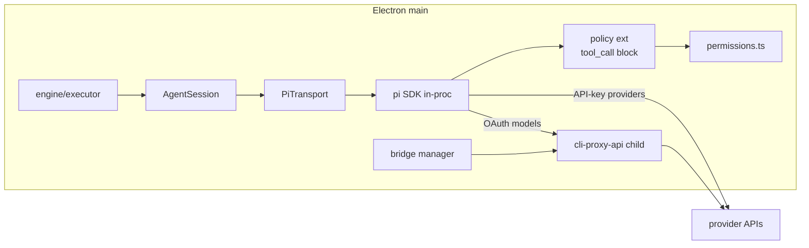

# Foundry: droid → Pi coding agent migration

Replace the entire Factory droid transport (SDK, daemon, one-shot CLI, Factory auth) with the open-source **`@earendil-works/pi-coding-agent`** (exact-pinned, in-process in Electron main), plus a **bundled CLIProxyAPI** ("Foundry Bridge") that turns users' provider OAuth logins (Claude, Codex, Gemini, Copilot, Kimi, Grok, …) into a localhost OpenAI-compatible endpoint that Pi consumes as custom models. MCP support is dropped (out of scope). No Factory credential, no closed SDK, everything pinned.

## 1. New Pi runtime layer — `src/main/pi/` (replaces `src/main/droid/`)

- **`runtime.ts`** — singleton `ModelRuntime.create({ authPath, modelsPath, modelsStorePath })` with all paths under `~/Library/Application Support/foundry/pi/` (Foundry-owned; never touches `~/.pi`). `PI_OFFLINE`-tolerant; refresh with bounded `AbortSignal.timeout`.
- **`transport.ts`** — keep today's transport seam, renamed vendor-neutral `AgentTransport` (same surface `AgentSession` consumes: `start/send/applySettings/contextStats/compact/rewind/interrupt/kill/close`, `id/alive/lastUserMessageId/availableModels/activeModel`). `PiTransport` implements it over an in-process pi `AgentSession`:
  - **create**: `createAgentSession({ cwd: worktree, modelRuntime, sessionManager: SessionManager.create(<run trace dir>/sessions), settingsManager: SettingsManager.inMemory({ compaction:{enabled:false}, retry:{enabled:true} }), resourceLoader })`. Custom `DefaultResourceLoader` with: worktree `cwd` (AGENTS.md context files load), `skillsOverride`/`promptsOverride` → empty, only Foundry's inline extension factories, `project_trust` handler returning `{trusted:"yes"}` (Foundry owns isolation via worktrees + boundary diff).
  - **turn**: `session.prompt(text)` awaited; `session.subscribe()` events mapped to trace (below); `abort()` = interrupt; kill latch preserved.
  - **model/effort**: `setModel(modelRuntime.getModel(provider, id))` + `setThinkingLevel(level)`. Effort map is 1:1 (`off|low|medium|high|xhigh|max`; pi adds `minimal`, unused). Bad-model refusal → warn + fall back, mirroring today's `modelRefused` latch.
  - **compact**: `session.compact()` (no successor-session dance — pi compacts in place; `adoptSuccessor` machinery is deleted).
  - **rewind**: phase anchor = session-entry id of the phase's first user message (from `session_start`/`message_start` events / `sessionManager.getEntries()`); rewind = `sessionManager.branch(anchorId)` + existing `boundary.restoreToPhaseStart`.
  - **contextStats**: from pi usage events + `contextWindow` (`tokens/limit/percent`). Droid's `ContextBreakdown` shape (incl. `droids` category) replaced by a simpler pi-derived breakdown; `breakdownFile()` and Inspector panel updated.
- **`tools.ts`** — Foundry custom tools via `defineTool` (TypeBox), replacing the MCP server: `report_progress`, `read_phase_context`, and **`submit_envelope`** (chosen envelope mechanism): per phase, engine passes the envelope JSON schema (zod4 `toJSONSchema`, structurally TypeBox-compatible); tool swapped between turns via `session.agent.state.tools`. Turn success requires a `submit_envelope` call; captured args become `structuredOutput`. Text-parse (`parseEnvelope`) stays as fallback within the existing `envelopeRetries` budget. Draft-07 `$schema` hack in `engine/envelopes.ts` deleted.
- **`policy-extension.ts`** — inline extension factory: `pi.on("tool_call")` → map pi tool names (`read/bash/edit/write/grep/find/ls` + foundry tools) to the existing policy categories → `permissions.evaluate()` → `{ block:true, reason }` on deny. Zero-interrupt preserved: read-only allow, out-of-boundary/protected write deny, bash allow (post-hoc git boundary diff remains authoritative). `excludeTools: ["ask_question"]`-style config so nothing prompts. `permissions.ts` keeps its logic; only tool-name mapping changes.
- **`events.ts`** — `EventFolder` rewritten to consume pi `AgentSessionEvent`s (`message_update` text/thinking deltas with same throttle/caps, `tool_execution_start/update/end` folded per `toolCallId`, `turn_end` usage). Raw event JSONL still written to `<agent>/stream.jsonl`. `UsageBreakdown` gains real `cost` from pi usage; `factoryCredits` dropped.
- **`oneshot.ts`** — replaces droid `exec` at all 5 call sites (detect, setup, repair/rebase, readiness remediator, run-start command fill): a short-lived in-process pi session with `SessionManager.inMemory(cwd)`; read-only sites pass `tools:["read","grep","find","ls"]`, write-capable sites (repair, readiness) get default tools + policy extension scoped to their worktree; streaming events feed the existing live transcripts; timeout + `abort()` for cancel. `src/main/cli/` (vendor adapters, argv/parse), `fake-droid.ts`, and `--help` catalog scraping are deleted entirely.
- **`catalog.ts`** — `modelRuntime.getAvailable()` (built-ins with keys + bridge custom models) → existing `ModelInfo[]`; `providerOf()` icon mapping reused/extended.

## 2. Foundry Bridge — `src/main/bridge/` (the baked-in droidproxy)

- **Vendored binary**: pin an exact CLIProxyAPI release (arm64), fetched at package time, shipped via electron-builder `extraResources`, code-signed with the app. Version pinned in `package.json` config + checksum verified by script.
- **`manager.ts`**: child-process lifecycle (like droidproxy's ServerManager): generate config (localhost bind, port from a scanned band replacing `daemonPort`, auth-dir under `App Support/foundry/bridge/auth/`), spawn with app-parent watchdog, health poll, traced `processes` row (`kind:'bridge'`), kill on quit. Started lazily on first OAuth-model use or Providers-panel open.
- **`auth.ts`**: run the binary's provider login flows (Claude/Codex/Gemini/Kimi/Grok/Copilot), open browser, watch auth dir (debounced) for account status/expiry; per-provider connect/disconnect surfaced over IPC. No secrets logged.
- **`models.ts`**: Foundry-owned model catalog (the `DroidProxyModelCatalog` analog): per authenticated provider, generate entries in pi's `models.json` (`baseUrl: http://127.0.0.1:<port>/v1`, correct `api` per provider — `openai-completions` / `anthropic-messages` / `openai-responses`, context windows, `reasoning` levels). Regenerated on auth changes; `modelRuntime.refresh()` after writes.
- **Direct API keys bypass the bridge**: Settings lets users store provider API keys straight into pi's `auth.json` (`modelRuntime.setRuntimeApiKey`/credential store) — those models talk to providers natively.
- Header/body rewrites (droidproxy's ThinkingProxy) are **not** ported initially; add a thin rewrite shim later only if a provider quirk demands it.

## 3. Removals

- `src/main/droid/**` (incl. `sdk/**`), `src/main/cli/**`, `@factory/droid-sdk` dep, eslint `no-restricted-imports` block (replaced: only `src/main/pi/**` may import `@earendil-works/pi-*`), `sdk-zod.ts` zod3 hack, daemon port settings, `factoryApiKey` setting + `FACTORY_API_KEY` spawn overlay + WorkOS JWT reader, `syncFactoryAuth()`.
- **MCP (out of scope per decision)**: `userMcpServers` setting + Settings UI section + `mcp.listTools` plumbing removed; foundry's own two tools survive as native pi custom tools.
- Doctor droid checks → new checks: bridge binary present/launchable, ≥1 usable model (`getAvailable()` non-empty), per-provider auth status.

## 4. Settings, onboarding, renderer

- Settings schema (with migration): drop `factoryApiKey`, `clis`, `defaultCli`, `detectCli`, `daemonPort`, `mcpServers`; keep `detectModel`, `readinessModel`, `defaultModel` etc. as `provider/model` ids; add `bridgePort`.
- Settings UI: "Agent CLI" + "Transport" + API-key sections replaced by a **Providers** panel (OAuth connect cards with status/expiry via bridge; API-key rows via pi credential store) + model default pickers fed by the new catalog.
- Onboarding `CliScreen` → `ProvidersScreen` (connect at least one provider or paste a key); copy/branding updated (`BrandIcon` pi mark, About text).
- Inspector: transport label `pi`, `ContextBreakdown` panel simplified, tool-name rendering updated for pi tool names; cost shown from real usage.

## 5. Persistence

- `runs.mode` / `agent_sessions.mode` gain `'pi'` (old `daemon|rpc|oneshot` rows stay readable). `droid_session_id` column reused to store the pi session id (read alias `agentSessionId`); `processes.kind` gains `'bridge'`, `'droid'` kept for old rows. Pi session `.jsonl` files persisted per run under the run's trace dir for debuggability.

## 6. Tests

- `ScriptedAgent`/`scripted-daemon`/`fake-droid` replaced by a `ScriptedTransport` implementing the neutral `AgentTransport` seam (no pi import) for executor/engine tests — same real-git worktree side-effect + real-permission-handler pattern; plus a `ScriptedPiSession` fake (pi `AgentSession`-shaped: `prompt/subscribe/abort/agent.state.tools`) for `PiTransport` unit tests. New suites: policy-extension mapping, submit_envelope flow, bridge manager (scripted child), models.json generation, oneshot sessions. `cli-vendors.test.ts` and `sdk-*.test.ts` deleted. Coverage floors kept.

## 7. Packaging / build

- `@earendil-works/pi-coding-agent` exact-pinned; externalized in main (as droid-sdk was); verify Electron 43's Node satisfies pi's `>=22.19` engines and add `asarUnpack` for pi runtime assets (jiti, `@silvia-odwyer/photon-node` wasm) as needed. `PI_OFFLINE`-safe startup (cached `models-store.json`). CI packaging step downloads + checksums the pinned CLIProxyAPI binary and signs it.

## 8. Implementation order (each lands green through `npm run check`)

1. **Runtime + transport core**: `src/main/pi/` (runtime, PiTransport, events, policy extension, tools incl. submit_envelope), neutral `AgentTransport` seam, engine wiring, ScriptedTransport test port. Droid path still present but unused.
2. **One-shots**: detect/setup/repair/readiness/run-fill on pi sessions; delete `cli/`, `oneshot.ts`.
3. **Bridge**: binary vendoring, manager, auth flows, models.json generation, catalog IPC.
4. **UI/settings/onboarding/doctor**: Providers panel, migrations, copy, Inspector updates.
5. **Removal + docs**: delete `src/main/droid/**`, `@factory/droid-sdk`, dead settings; update all `AGENTS.md` guides, README, `check:docs` targets; e2e fixture seeds.

**Validation**: `npm run check` per phase; `foundry-ui` skill drive of a real run (detect → phases → envelope → merge) with a live provider after phase 3.

**Key risks**: TypeBox-vs-zod4 JSON-schema compatibility for `submit_envelope` (fallback: hand-write TypeBox schemas for the 5 envelope kinds); CLIProxyAPI response fidelity for reasoning models without ThinkingProxy rewrites (mitigation: per-provider `api` choice, shim later); pi in-process crash isolation (mitigation: all pi calls behind try/catch in PiTransport, failures become failed turns exactly like daemon-unreachable today).
