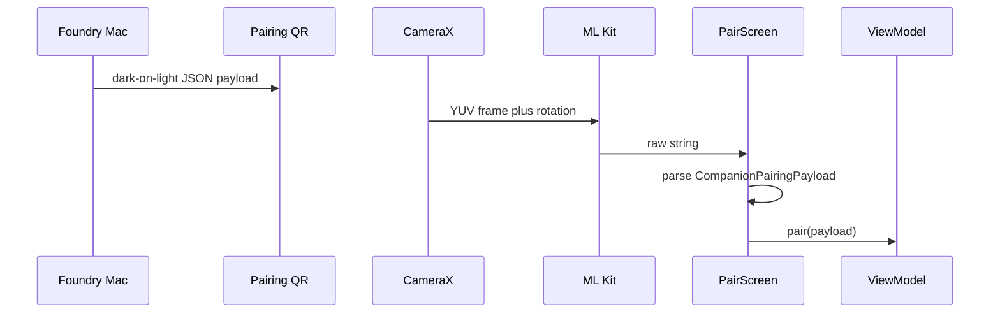

# Fix Foundry companion QR scanning

Foundry’s pairing QR does not scan because the Android decoder is a hand-rolled ZXing YUV analyzer, and the desktop QR is inverted light-on-dark. Ghostty XR already has a working CameraX + ML Kit path. Copy that scanner shape only. Do not take XR tracking, SSH URLs, host fingerprints, Nearby, or token-rotation.

## Why it fails today

Desktop (`SettingsScreen` + `QrCode.tsx`) encodes the full `CompanionPairingPayload` JSON (version ~7+) as **light modules on `#050505`**. That is a non-standard inverted code.

Android (`PairScreen.kt` `QrCodeAnalyzer`) feeds CameraX frames into ZXing `PlanarYUVLuminanceSource` using only plane 0, with no row-stride handling, no rotation, and no invert/try-harder hints. After the first successful decode it also sets `isScanning = false`, so a bad first read or a failed pair permanently kills the camera until remount.

Ghostty’s working path (`ghosttyxr/android/.../qr/QrScannerScreen.kt` → `CameraQrScannerContent`) is CameraX preview + `ImageAnalysis` + ML Kit `BarcodeScanning.getClient(FORMAT_QR_CODE)` via `InputImage.fromMediaImage(image, rotationDegrees)`. Mac side uses a normal dark-on-light QR (`CIQRCodeGenerator`).

## Target behavior

Paste-JSON fallback, protocol checks, and `POST /pair` stay as they are.

## Android scanner

Replace the ZXing analyzer in `android/app/src/main/java/com/foundry/companion/ui/screens/pair/PairScreen.kt` with Ghostty’s CameraX + ML Kit loop:

- `PreviewView` + `Preview` + `ImageAnalysis.STRATEGY_KEEP_ONLY_LATEST`
- `BarcodeScanning.getClient(FORMAT_QR_CODE)`
- `InputImage.fromMediaImage(image, proxy.imageInfo.rotationDegrees)`
- Close the `ImageProxy` in `addOnCompleteListener` (not before the async process finishes)
- `DisposableEffect` shuts down the analyzer executor and `barcodeScanner.close()`
- Dedup on last decoded raw string so `viewModel.pair()` is not fired every frame
- If parse/pair fails, keep scanning; do not latch `isScanning = false` forever
- Keep the existing 280dp viewfinder, reticle, permission flow, and paste fallback

Add `com.google.mlkit:barcode-scanning` in `android/app/build.gradle.kts` and drop `com.google.zxing:core`.

Do **not** add Android XR `QrCode.subscribe`, scene-understanding permission, spatial panels, or Ghostty’s `ssh://` `PairingPayload` parser.

## Desktop QR polarity

In both Companion QR sites in `src/renderer/screens/SettingsScreen.tsx`, and in `QrCode.tsx` defaults:

- `bgColor = '#FFFFFF'`
- `fgColor = '#000000'`

Give `.qrFrame` a white backing and a little more padding so the quiet zone is actually quiet against the dark settings panel. Keep `JSON.stringify(pairingPayload)`, EC level `M`, and the custom `qr-matrix.ts` generator.

## Out of scope

- Pairing protocol, secret TTL, HTTP host, or payload shape
- Ghostty SSH provisioning / fingerprints / Nearby
- Full-screen QR expansion
- Website

## Validation

- Android: `./gradlew :app:testDebugUnitTest` (existing `PairScreenScreenshotTest` still uses paste mode)
- Desktop: `npx vitest run tests/qrcode.test.ts` plus typecheck/lint if Settings/QrCode change
- Manual: Settings → Companion QR on a Mac, scan with the companion app; paste path still works

No `npm run check` / app launch unless implementation later needs it. The JS gate ignores `android/`.
