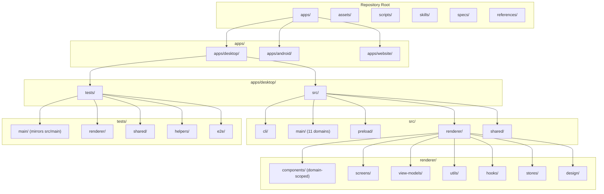

# Reorganize Repository Structure Plan

## Overview & Goals

Restructure the entire repository into a clean multi-app layout under `apps/` (`apps/desktop`, `apps/android`, `apps/website`), implement deep domain-driven folder organization for the Electron desktop app renderer (`components/`, `view-models/`, `utils/`), and mirror the test suite structure in `tests/` to match `src/` modules.



---

## 1. Directory Structure

### Top-Level Layout

```
.
├── apps/
│   ├── android/               ← Companion Android app (Kotlin / Compose, moved from android/)
│   ├── website/               ← Marketing & documentation website (moved from website/)
│   └── desktop/               ← Native macOS Electron app
│       ├── src/
│       │   ├── cli/           ← foundry-cli standalone helper binary
│       │   ├── main/          ← Privileged Node main process (modular domain subfolders)
│       │   │   ├── bridge/
│       │   │   ├── companion/
│       │   │   ├── engine/
│       │   │   ├── ipc/
│       │   │   ├── pi/
│       │   │   ├── readiness/
│       │   │   ├── session/
│       │   │   ├── smith/
│       │   │   ├── store/
│       │   │   ├── system/
│       │   │   └── trace/
│       │   ├── preload/       ← Narrow sandboxed CJS bridge (bridge.ts)
│       │   ├── renderer/      ← React 19 UI
│       │   │   ├── components/
│       │   │   │   ├── common/    ← PromptPreview, JsonView, ModelPicker, StatusBadge, ConfirmModal, EmptyState
│       │   │   │   ├── inspector/ ← TranscriptLane, ContextBreakdown, collapse, entries
│       │   │   │   ├── layout/    ← Sidebar, SidebarEmblems, UpdateBanner
│       │   │   │   ├── media/     ← AgentAvatar, AgentIconPicker, BrandIcon, Emblem, QrCode, qr-matrix
│       │   │   │   ├── pipeline/  ← PipelineCanvas, PipelineRibbon, PipelineSheet, PhaseDrawer, PhaseEditor, PhaseGlyphs, BoundaryEditor, EnvelopesEditor
│       │   │   │   ├── project/   ← NewProjectWizard, ProjectCommands, ProjectSetup, BaseSyncBar, CustomFieldsEditor, DesignScopeControl
│       │   │   │   ├── readiness/ ← ReadinessFlow, DetectionPanel, DoctorList
│       │   │   │   ├── run/       ← OutcomeBanner, Waterfall, InterruptSheet, DryRunSheet
│       │   │   │   ├── smith/     ← SmithLauncher, SmithProposalCard
│       │   │   │   └── ui/        ← Base DS components (Button, CodeBlock, Dropdown, Field, Issues, ModalShell, SaveState, SegmentedControl, SideSheet, Toggle)
│       │   │   ├── screens/       ← Screen components
│       │   │   │   ├── onboarding/
│       │   │   │   └── DesignScreen, InspectorScreen, PipelinesScreen, PullRequestsScreen, RosterScreen, RunDetailScreen, RunsScreen, SettingsScreen
│       │   │   ├── view-models/   ← Screen & entity view-models / draft handlers (pipeline-view, readiness-view, base-sync-view, custom-fields, design-scope, pr-draft, roster-draft, settings-search)
│       │   │   ├── utils/         ← Pure helpers (derive, format, keyboard, local-store, navigation)
│       │   │   ├── hooks/         ← Custom React hooks (useAgentModels, useDebouncedSave, etc.)
│       │   │   ├── stores/        ← React state stores (app, run)
│       │   │   ├── design/        ← Tokens & fonts
│       │   │   ├── assets/        ← Renderer assets
│       │   │   ├── api.ts         ← Typed window.foundry bridge
│       │   │   ├── mockFoundry.ts ← Web mock API
│       │   │   ├── App.tsx & App.module.css
│       │   │   └── main.tsx & index.html
│       │   └── shared/        ← Pure types & IPC contracts shared across main/renderer/cli
│       └── tests/             ← Vitest & Playwright test suites mirroring src
│           ├── main/
│           │   ├── bridge/    ← bridge-catalog, bridge-manager, bridge-models, bridge-process-row, bridge-service
│           │   ├── companion/ ← companion, qrcode
│           │   ├── engine/    ← acceptance, base-sync, boundary, detect-session, detect, envelopes, executor, gates, git, preflight, prompts, repair, rewinder, settle, setup-session, worktree
│           │   ├── ipc/       ← ipc-clone, ipc-surface
│           │   ├── pi/        ← agent-session-transport, pi-catalog, pi-events, pi-extension, pi-oneshot, pi-packaging, pi-policy, pi-runtime, pi-tools, pi-transcript, pi-transport
│           │   ├── readiness/ ← readiness-evaluate, readiness-flow, readiness-ignore, readiness-marker, readiness-view
│           │   ├── session/   ← panel-session
│           │   ├── smith/     ← smith-cli-args, smith-launch, smith-proposals, smith-protocol, smith-skill, smith-socket, smith-start
│           │   ├── store/     ← builtins, envelope-store, local-store, pipeline-validate, pipelines-migrate, project-scope-store, roster-rename, roster-validate, settings-store
│           │   ├── system/    ← doctor, env, gh, procs-terminate, updater
│           │   └── trace/     ← trace-cursor
│           ├── renderer/      ← agent-emblems, agent-marks, base-sync-view, brand-icons, confirm-action, custom-fields, design-navigation, design-scope, inspector-lane-header, keyboard, new-project, pipeline-view, pr-draft, roster-draft, settings-search, sidebar-emblems, transcript-entries
│           ├── shared/        ← model-visibility
│           ├── helpers/       ← fake-gh, scripted-oneshot, scripted-transport, setup-tmp, tmp, e2e-fixture
│           ├── fixtures/      ← cliproxy-models.json
│           └── e2e/           ← Playwright Electron UI smoke specs & harness
├── assets/                    ← Shared branding & artwork
├── references/                ← Pinned vendor docs
├── scripts/                   ← Repo maintenance & verification scripts
├── skills/                    ← Agent skills (foundry-smith)
└── specs/                     ← Historical architecture specs
```

---

## 2. Key Configuration Updates

### `electron.vite.config.ts`

```ts
const alias = {
  '@shared': resolve(import.meta.dirname, 'apps/desktop/src/shared'),
  '@main': resolve(import.meta.dirname, 'apps/desktop/src/main'),
  '@renderer': resolve(import.meta.dirname, 'apps/desktop/src/renderer'),
};

export default defineConfig({
  main: {
    resolve: { alias },
    plugins: [externalizeDepsPlugin()],
    build: {
      lib: {
        entry: {
          main: resolve(import.meta.dirname, 'apps/desktop/src/main/main.ts'),
          'foundry-cli': resolve(import.meta.dirname, 'apps/desktop/src/cli/foundry-cli.ts'),
        },
      },
      rollupOptions: { output: { format: 'es' } },
      minify: 'esbuild',
    },
  },
  preload: {
    resolve: { alias },
    plugins: [externalizeDepsPlugin()],
    build: {
      lib: { entry: resolve(import.meta.dirname, 'apps/desktop/src/preload/bridge.ts') },
      rollupOptions: { output: { format: 'cjs', entryFileNames: 'bridge.cjs' } },
      minify: 'esbuild',
    },
  },
  renderer: {
    resolve: { alias },
    plugins: [react()],
    root: resolve(import.meta.dirname, 'apps/desktop/src/renderer'),
    css: { modules: { localsConvention: 'camelCase' } },
    build: {
      minify: 'esbuild',
      chunkSizeWarningLimit: 1000,
      rollupOptions: {
        input: resolve(import.meta.dirname, 'apps/desktop/src/renderer/index.html'),
      },
    },
  },
});
```

### `tsconfig.json`

```json
{
  "compilerOptions": {
    "baseUrl": ".",
    "paths": {
      "@shared/*": ["apps/desktop/src/shared/*"],
      "@main/*": ["apps/desktop/src/main/*"],
      "@renderer/*": ["apps/desktop/src/renderer/*"]
    }
  },
  "include": [
    "apps/desktop/src/**/*",
    "apps/desktop/tests/**/*",
    "scripts/**/*",
    "*.config.*",
    "*.config.mts"
  ]
}
```

### `vitest.config.ts`

```ts
export default defineConfig({
  resolve: {
    alias: {
      '@shared': resolve(import.meta.dirname, 'apps/desktop/src/shared'),
      '@main': resolve(import.meta.dirname, 'apps/desktop/src/main'),
      '@renderer': resolve(import.meta.dirname, 'apps/desktop/src/renderer'),
    },
  },
  test: {
    include: ['apps/desktop/tests/**/*.test.ts'],
    environment: 'node',
    testTimeout: 30_000,
    pool: 'forks',
    setupFiles: ['apps/desktop/tests/helpers/setup-tmp.ts'],
    server: {
      deps: { inline: [/@lobehub\/icons/] },
    },
    coverage: {
      provider: 'v8',
      reporter: ['text-summary', 'text', 'html'],
      reportsDirectory: 'coverage',
      include: [
        'apps/desktop/src/main/**/*.ts',
        'apps/desktop/src/shared/**/*.ts',
        'apps/desktop/src/cli/**/*.ts',
      ],
      exclude: [
        'apps/desktop/src/renderer/**',
        'apps/desktop/src/preload/**',
        'apps/desktop/src/main/main.ts',
        '**/*.d.ts',
      ],
      all: true,
      thresholds: {
        statements: 62,
        branches: 54,
        functions: 61,
        lines: 65,
      },
    },
  },
});
```

### `eslint.config.js`

```js
// Update ignores and path matchers:
ignores: ([
  'out/**',
  'dist/**',
  'node_modules/**',
  'coverage/**',
  'assets/**',
  'apps/website/**',
  'apps/android/**',
  '.foundry-worktrees/**',
  '.codegraph',
  'package-lock.json',
  'scripts/**/*.mjs',
],
  // ...
  {
    files: [
      'apps/desktop/src/main/pi/**/*.ts',
      'apps/desktop/tests/**/pi-*.test.ts',
      'apps/desktop/tests/main/pi/**/*.test.ts',
    ],
    rules: { 'no-restricted-imports': 'off' },
  },
  {
    files: [
      'apps/desktop/src/main/**/*.{ts,tsx}',
      'apps/desktop/tests/**/*.ts',
      'scripts/**/*.ts',
      'playwright.config.ts',
    ],
    languageOptions: { globals: { ...globals.node } },
  },
  {
    files: ['apps/desktop/src/preload/**/*.ts'],
    languageOptions: { globals: { ...globals.node, ...globals.browser } },
  });
```

### `knip.json`, `playwright.config.ts`, `vite.web.config.ts`, `scripts/*.mjs`

- `knip.json`: update paths to `apps/desktop/src/*` and project/entry to `apps/desktop/src/**` and `apps/desktop/tests/**`.
- `playwright.config.ts`: `testDir: 'apps/desktop/tests/e2e'`.
- `scripts/check-css-collisions.mjs`: `rendererRoot = new URL('../apps/desktop/src/renderer', import.meta.url).pathname`.
- `scripts/check-docs-commands.mjs`: scan `findNestedAgentDocs('apps/desktop/src')`.
- `.github/workflows/ci.yml`: Android step `working-directory: apps/android`, path triggers `apps/**`.

---

## 3. Implementation Steps

1. **Move Companion & Marketing Apps to `apps/`**:
   - `git mv android apps/android`
   - `git mv website apps/website`
   - Create `apps/desktop`

2. **Move Desktop Source & Tests into `apps/desktop/`**:
   - Move `src/` to `apps/desktop/src/`
   - Move `tests/` to `apps/desktop/tests/`

3. **Reorganize Desktop Renderer**:
   - Move components into domain subfolders (`pipeline/`, `run/`, `project/`, `readiness/`, `smith/`, `layout/`, `media/`, `common/`).
   - Move view-model files into `apps/desktop/src/renderer/view-models/`.
   - Move utilities into `apps/desktop/src/renderer/utils/`.
   - Update component and view-model import paths in `App.tsx`, `screens/`, etc. (Spawning worker subagents to assist with batch import updates).

4. **Reorganize Desktop Tests**:
   - Move main tests into `apps/desktop/tests/main/{engine,pi,smith,bridge,readiness,store,system,companion,session,trace,ipc}/`.
   - Move renderer tests into `apps/desktop/tests/renderer/`.
   - Move shared tests into `apps/desktop/tests/shared/`.
   - Move test helpers (`scripted-transport.ts`, `scripted-oneshot.ts`, `fake-gh.ts`, `tmp.ts`, `setup-tmp.ts`, `e2e-fixture.test.ts`) into `apps/desktop/tests/helpers/`.
   - Move fixtures into `apps/desktop/tests/fixtures/`.
   - Update test helper import paths across all test files.

5. **Update Tooling & Configs**:
   - Update `tsconfig.json`, `electron.vite.config.ts`, `vitest.config.ts`, `eslint.config.js`, `knip.json`, `playwright.config.ts`, `vite.web.config.ts`, `scripts/check-css-collisions.mjs`, `scripts/check-docs-commands.mjs`, `.github/workflows/ci.yml`, `.gitignore`, `.prettierignore`.

6. **Update Documentation (`AGENTS.md`)**:
   - Update root `AGENTS.md` and all subfolder `AGENTS.md` to reflect new directory paths and vitest command locations.

7. **Validation**:
   - Run full verification: `npm run check` (typecheck, lint, format:check, knip, test:coverage, build, check:css, check:docs, audit:deps).
   - Verify Android tests: `cd apps/android && ./gradlew :app:testDebugUnitTest`.
