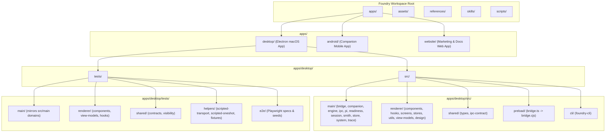

# Comprehensive Repository Reorganization to Apps Multi-App Architecture

## 1. Summary of Architecture & Migrations

The repository has been restructured into an `apps/` multi-app layout to separate apps cleanly, decompose large flat directories, and mirror source structure in tests.

### Top-Level Directory Layout

- **`apps/desktop/`**: macOS Electron application (`src/` + `tests/`).
- **`apps/android/`**: Android Companion application (Kotlin / Jetpack Compose).
- **`apps/website/`**: Marketing and product documentation website (Vite / Tailwind).
- **`assets/`**, **`skills/`**, **`references/`**, **`scripts/`**: Shared top-level assets, Smith skill packages, vendor reference docs, and build/validation scripts.

### Renderer Decomposition (`apps/desktop/src/renderer/`)

- **`components/`**: Decomposed from a flat directory into 10 domain folders:
  - `common/`: `ConfirmAction`, `Tooltip`, `ErrorBoundary`, `ShortcutKey`
  - `inspector/`: `Entries`, `WaterfallCard`, `InspectorLaneHeader`, `EventIcon`
  - `layout/`: `Sidebar`, `AppHeader`, `WindowControls`
  - `media/`: `AgentEmblem`, `BrandIcon`, `AgentMark`
  - `pipeline/`: `PipelineCard`, `PhasePill`, `PipelineEditor`
  - `project/`: `ProjectPicker`, `ProjectList`, `ProjectCard`
  - `readiness/`: `ReadinessCheckCard`, `MarkerBadge`, `DetectionPanel`
  - `run/`: `RunCard`, `Waterfall`, `OutcomeBanner`, `RunSummary`
  - `smith/`: `SmithLauncher`, `SmithProposalCard`, `SmithActivity`
  - `ui/`: `Button`, `Dialog`, `Input`, `Select`, `Toggle`, `Badge`
- **`view-models/`**: State models and draft state holders (`base-sync-view.ts`, `custom-fields.ts`, `design-scope.ts`, `pipeline-view.ts`, `pr-draft.ts`, `readiness-view.ts`, `roster-draft.ts`, `settings-search.ts`).
- **`utils/`**: Shared client utility modules (`derive.ts`, `format.ts`, `keyboard.ts`, `local-store.ts`, `navigation.ts`).

### Test Hierarchy Mirroring (`apps/desktop/tests/`)

- **`main/`**: Domain tests mirroring `src/main/` (`bridge/`, `companion/`, `engine/`, `ipc/`, `pi/`, `readiness/`, `session/`, `smith/`, `store/`, `system/`, `trace/`).
- **`renderer/`**: UI component and view-model test suites.
- **`shared/`**: Contract and type invariant tests.
- **`helpers/`**: Shared test doubles and harnesses (`scripted-transport.ts`, `scripted-oneshot.ts`, `e2e-fixture.test.ts`, `tmp.ts`, `setup-tmp.ts`).
- **`e2e/`**: Playwright Electron end-to-end smoke specs.

---

## 2. Configuration & Tooling Updates

All configuration files and build scripts are updated for the new structure:

- `tsconfig.json`: Path aliases updated to `@shared/* -> apps/desktop/src/shared/*`, `@main/* -> apps/desktop/src/main/*`, `@renderer/* -> apps/desktop/src/renderer/*`, with inclusion globs matching `apps/desktop/src/**/*`, `apps/desktop/tests/**/*`, `scripts/**/*`.
- `electron.vite.config.ts`: Aliases updated to `apps/desktop/src/*` and entry points explicitly configured.
- `vitest.config.ts`: Aliases updated, test inclusions set to `apps/desktop/tests/**/*.test.ts`, setup files pointed to `apps/desktop/tests/helpers/setup-tmp.ts`, and coverage thresholds bound to `apps/desktop/src/{main,shared,cli}/**`.
- `eslint.config.js`: Ignored paths and restricted pi-import glob boundaries updated to match `apps/desktop/src/**`.
- `knip.json`: Entry points and paths updated for desktop, website, and scripts.
- `playwright.config.ts`: `testDir` pointed to `apps/desktop/tests/e2e`.
- `vite.web.config.ts` & `vite.preview.config.mts`: Root and public directory paths updated.
- `scripts/check-css-collisions.mjs`: `rendererRoot` set to `apps/desktop/src/renderer`.
- `scripts/check-docs-commands.mjs`: Agent doc finder updated for `apps/desktop/src`.
- `.github/workflows/ci.yml`: Android build directory updated to `apps/android`.
- `AGENTS.md` and all sub-domain `AGENTS.md` files: Paths and testing commands updated.

---

## 3. Verification & Quality Gates

The full test and check suite passes cleanly:

- `npm run typecheck`: 0 errors
- `npm run lint`: 0 warnings, 0 errors
- `npm run format:check`: 100% formatted
- `npm run knip`: clean
- `npm run test:coverage`: **83 suites, 1,231 tests passing** with all coverage thresholds satisfied
- `npm run build`: `electron-vite build` (main + preload + renderer) builds cleanly
- `npm run check:css`: 0 class collisions
- `npm run check:docs`: 100% verified across 17 docs and 9 command sources
- `npm run audit:deps`: 0 vulnerabilities
- `npm run check`: full verification suite exits code 0
