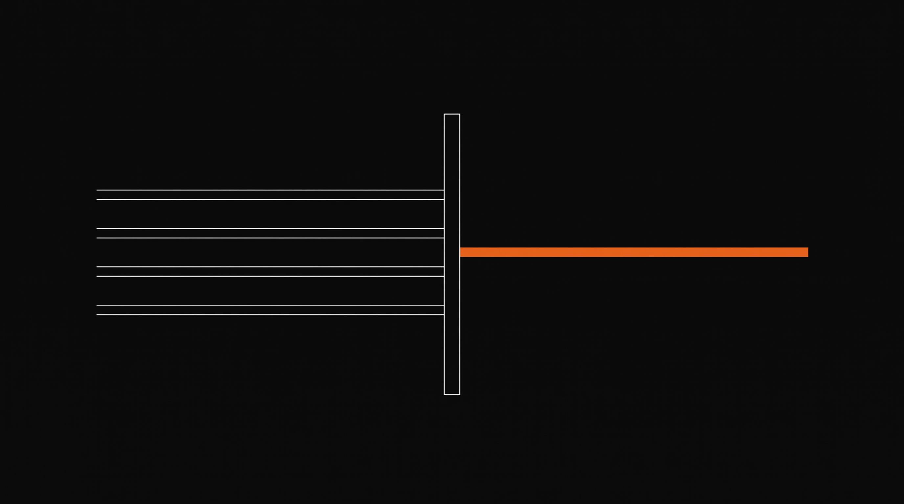
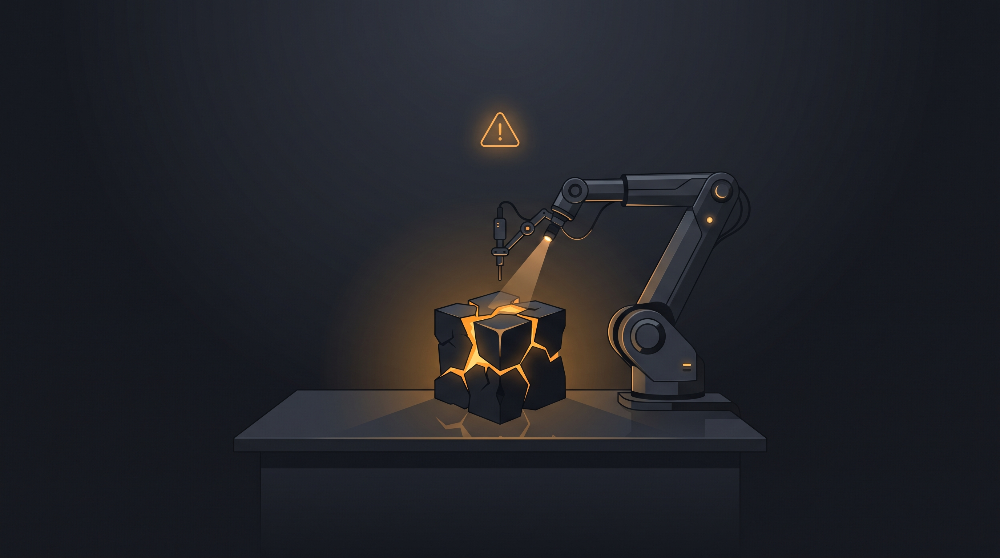

# Foundry

> **Describe what you want. Watch it get built.**

  

  A native macOS app that turns a prompt into real, reviewed code — in an isolated worktree you can watch live.

---

Foundry is a software factory for your Mac. You type a request, pick a pipeline, and a team of specialized agents does the work. Every step leaves evidence you can read: what was tried, what was checked, and why it passed or failed. Your main branch is never touched until you say so.

No chat tricks. No scripts to maintain. Just describe the change and judge the result.

  

## Download

**Requirements:** macOS 26+, Apple Silicon, `git`, and the [droid](https://docs.factory.ai) CLI installed and signed in.

1. Download the latest `Foundry.dmg` from [Releases](https://github.com/nikships/software-factory/releases)
2. Drag Foundry to Applications and open it
3. Follow the onboarding, add a git repository as your project, and you are ready

All of your code stays on your machine. Runs are local, traces are local, worktrees are local.

## Get started in 60 seconds

1. **Add a project** — point Foundry at any git repository on disk
2. **Describe the work** — "Add rate limiting to the public API" is a complete brief, the more specific the better
3. **Pick a pipeline** — choose how thorough you want the factory to be
4. **Start the run** — Foundry branches off your base ref and gets to work in an isolated worktree
5. **Watch and judge** — follow the live waterfall, inspect any phase, and merge when you accept the result

  

## How it works

### Pipelines, not prompts

A pipeline is a recipe made of phases. Each phase has one job and one way to be judged. You can reorder them, swap who does them, and save your own. No code to write.

Foundry ships with seven, all editable:

| Pipeline | What it does | When to use it |
|---|---|---|
| **Prompt** | One agent, one answer | Quick questions |
| **Scout** | Read-only reconnaissance with evidence | "Where is this and what touches it?" |
| **Plan** | Produces a concrete plan and commits it | You want a spec before code |
| **Plan → Build** | Plan, then implement | The default for most changes |
| **Plan → Build → Test** | Plan, build, then prove it with your own tests | You want green tests before merge |
| **Plan → Build → Review** | Plan, build, then a second agent checks it | You want a second pair of eyes |
| **Full SDLC** | Plan, build, test, review, and document | The full chain, with a commit at each boundary |

  

The Pipeline Designer is visual and live. Drag to reorder, change acceptance, add a checkpoint where a human decides, and see validation as you type. Changes save automatically.

### A roster of specialists

Five agents cover the work. Each one has its own model, instructions, and limits — and you can edit all of it or add your own.

| Agent | Role |
|---|---|
| **planner** | Turns your request into a plan a builder can follow without guessing |
| **builder** | Implements the plan and lists every file it changed |
| **scout** | Maps the codebase and answers with paths and symbols, changes nothing |
| **reviewer** | Checks the diff against your request, one finding per requirement |
| **documenter** | Writes down what changed for the next person |

There is no separate tester agent. Running tests is a real command in your repo, so Foundry runs it as a real command and hands failures back to the builder to fix.

### Powered by Factory Droid

Foundry drives **Factory Droid** as its core agent harness, providing live JSON-RPC tool streaming, model selection, and execution context.

### Safe by design

* **Your checkout stays clean.** Every run gets its own git worktree and `foundry/run_*` branch. Nothing lands on your base branch until you merge.
* **Agents cannot write outside their lane.** Each agent has a write boundary (unrestricted, read-only, or a set of allowed paths). Writes outside it are reverted and the phase fails.
* **Protected paths are always protected.** `.git`, CI config, and lockfiles are off limits no matter what the agent says.
* **Gates check the work.** Automatic checks verify that claimed files exist, are not empty, match the diff, and that a review's verdict matches its findings. A green gate tells you what it checked.

### Watch it work

The Inspector is a live waterfall. Tool calls stream in mid-phase, envelopes and gate evidence are inspectable per phase, and cost and timing fill in as they are reported. The same view works for live runs and history.

  

Runs can pause for you at any **Checkpoint** phase — approve, edit, or reject and the factory continues. Notifications and the dock badge tell you when a run needs input or finishes, on your terms.

## The app

* **Runs** — compose a request, pick a pipeline, start a run, and scan history
* **Inspector** — the live timeline for whatever is running, with full phase detail
* **Pipelines** — design and duplicate pipelines without writing scripts
* **Roster** — edit agents, select models, tune prompts and boundaries
* **Settings** — projects, commands, protected paths, notifications, updates, and maintenance

Foundry feels at home on the Mac: native windowing, Finder integration, auto-updates with progress and restart, and a clean, fast UI that stays out of your way.

  

## Philosophy

**Agent proposes, code disposes.** Agents do the creative work inside a phase. Code decides if the phase succeeded. Sequencing, retries, corrections, and acceptance live in the factory, never in a prompt.

That is why the same request gives you the same kind of result twice.

## License

MIT
