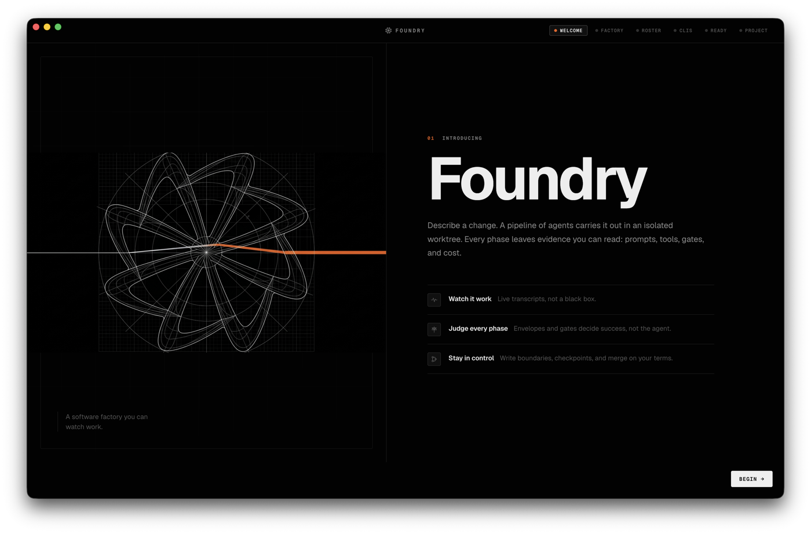
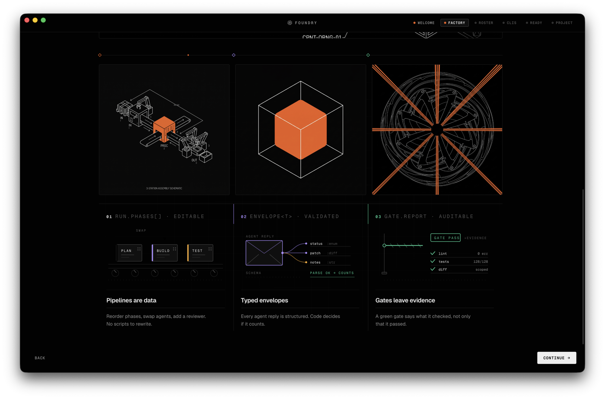
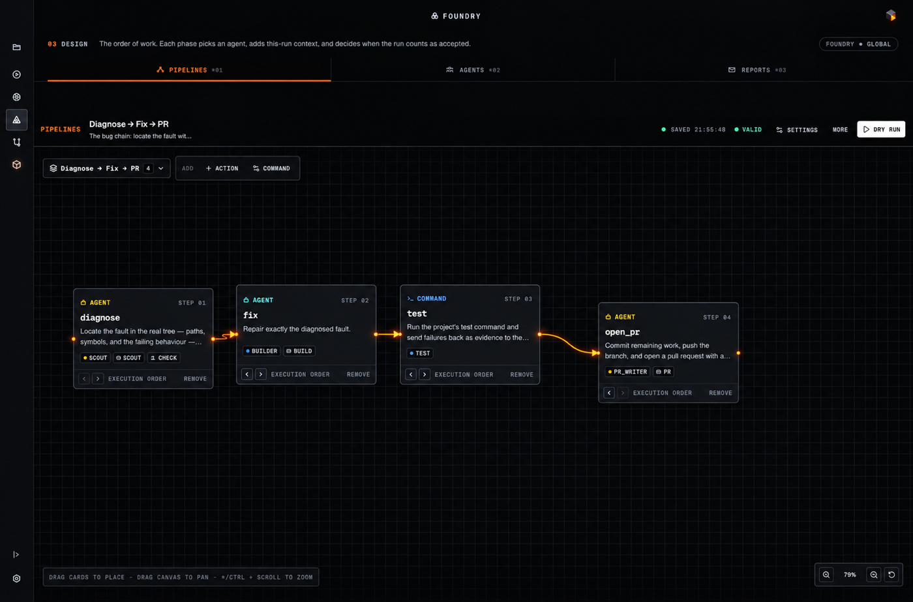
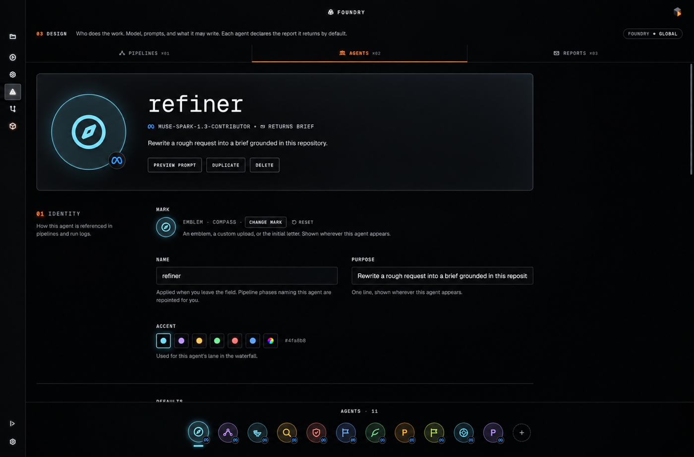

# Foundry

**Describe what you want. Watch it get built.**

**The software factory for builders who ship.**

If you're still babysitting a single agent in a terminal, you're moving slow. Foundry runs a whole team, in parallel, in isolation — and shows you every move.

[Download for Mac](https://github.com/nikships/foundry/releases) · macOS 26+ · Apple Silicon

---

## You're moving too slow

Claude Code is incredible. But one agent, one chat, one thread — you prompt, you wait, you review, you re-prompt. You are the orchestrator, the QA, and the git janitor.

**Foundry is the factory you actually wanted.** You describe the work, pick how rigorous to be, and a roster of specialists builds it in an isolated worktree while you watch a live waterfall of real evidence. When it's right, you merge. When it's not, you see exactly where the line failed, retool the pipeline, and run it again — scrap the part, not the factory.

Builders using Foundry aren't just prompting. They're shipping.

  

## What this actually is

Foundry is a native macOS app. Not a CLI wrapper. Not a chat skin.

You point it at any git repo. Every run gets its own branch and worktree. Every phase leaves typed evidence — what was tried, what was checked, why it passed or failed. Code judges the work, not the model.

**Agent proposes. Code disposes.** That's why the same request gives you the same _kind_ of result twice.

  

## Pipelines, not prompts

A pipeline is a recipe — not a mega-prompt. Each phase has one job and one way to be judged. Drag to reorder, swap who does what, add a checkpoint. Save it. Ship it again tomorrow.

Five built-ins, from fast to full-factory — every one ends in a pull request:

| Pipeline                       | When to use it                                               |
| ------------------------------ | ------------------------------------------------------------ |
| **Plan → Build → Test → PR**   | The standard: spec, build, prove with your tests, open PR.   |
| **Diagnose → Fix → PR**        | Bug work: find the fault with evidence, fix exactly that.    |
| **Spec → PR**                  | No code changes — survey the repo, PR an implementable spec. |
| **Refine → Build → Ship → PR** | Sharpens the ask, builds, holds to ship bar, re-proves it.   |
| **Full SDLC → PR**             | Refine, plan, build, test, polish, review, docs, PR.         |

Nothing is committed unproven: every code edit runs your tests before the commit that records it, and a reviewer who doesn't approve halts the run before it can reach the PR.

All editable on a freeform canvas. No scripts to write.

  

## A crew, not a chatbot

Seven specialists, each with their own model, prompt, and write boundaries. Or bring your own.

| Agent          | What they do                                          |
| -------------- | ----------------------------------------------------- |
| **refiner**    | Turns a half-formed ask into a grounded brief         |
| **planner**    | Writes the plan the builder needs — no questions left |
| **builder**    | Builds exactly what the plan says                     |
| **scout**      | Maps the repo and answers with paths and symbols      |
| **reviewer**   | Checks the diff against your original request         |
| **finisher**   | Audits to ship bar and closes the gaps                |
| **documenter** | Leaves the trail for the next person                  |

You're not locked in — open the Roster, retune the prompt, change the model, tighten what they can touch.

  

## Watch every move

No black box. The Inspector is a live waterfall — tool calls streaming mid-phase, envelopes and gate evidence inspectable per phase, cost and timing filling in as you go. Same view for live runs and history.

Pause at any checkpoint. Approve, edit, or reject — the factory keeps going.

  

## Safe by default

- **Your checkout stays clean.** Every run is an isolated worktree on its own branch. Nothing lands on `main` until you merge it.
- **Agents stay in their lane.** Write boundaries are enforced by git diff after every call. Violations get reverted and the phase fails.
- **Gates check the work.** Claimed files exist? Not empty? Diff matches the claim? Verdict matches the findings? Green means it was actually checked.

Failed runs keep their worktree so you can open it, learn, and discard deliberately.

## Get started in 60 seconds

**Requirements:** macOS 26+, Apple Silicon, `git`, and a model provider signed in through Settings → Providers.

1. [Download `Foundry.dmg`](https://github.com/nikships/foundry/releases) and drag to Applications
2. Open Foundry, add any git repo as a project
3. Describe the work — _"Add rate limiting to the public API"_ is a complete brief
4. Pick a pipeline and hit run
5. Watch the waterfall, inspect any phase, merge when you're happy

No `npm ci`. No setup script. Just download and build.

## Philosophy

**Agent proposes, code disposes.** Agents do the creative work. Code decides if it counted. Sequencing, retries, and acceptance live in the factory — never in a prompt.

That's why Foundry doesn't feel like chatting. It feels like running a shop.

---

MIT · Built for builders who ship

