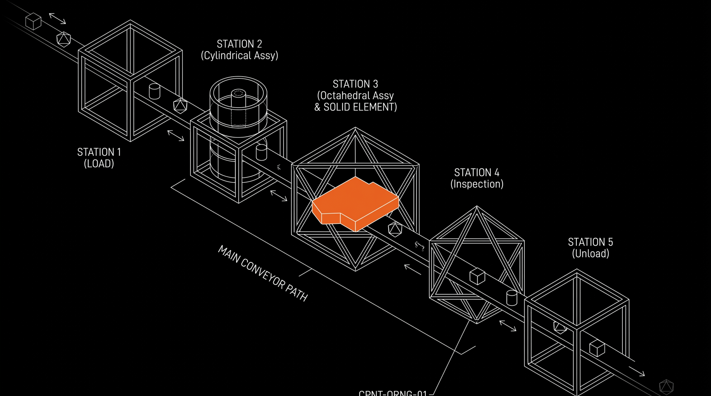
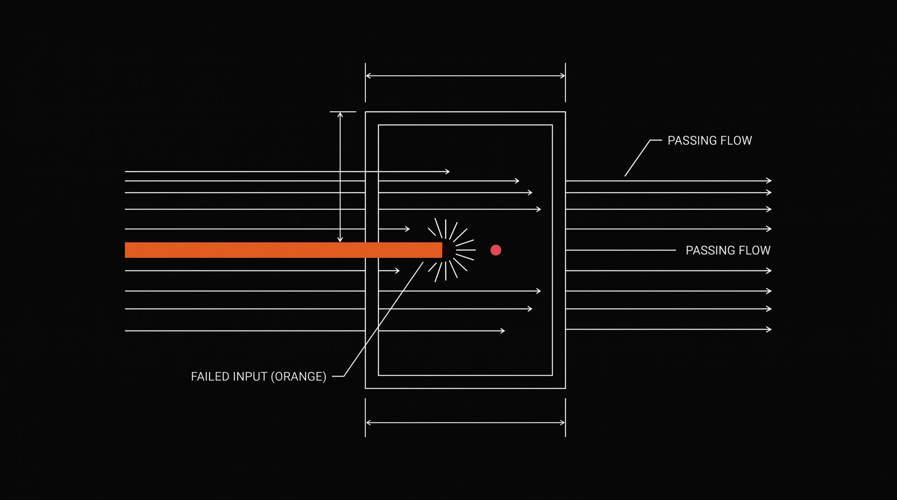

# Foundry

> **Describe what you want. Watch it get built.**

  

  An Electron desktop app for macOS — flat blacks, hairlines, Geist Mono, one Factory orange — that turns a prompt into reviewed code in an isolated worktree you can watch live.

---

Foundry is a software factory for your Mac. You type a request, pick a pipeline, and a team of specialized agents does the work. Every step leaves evidence you can read: what was tried, what was checked, and why it passed or failed. Code decides if a phase succeeded — not the model.

No chat tricks. Just describe the change and judge the result.

> **Factory industrial, on purpose.** Dark surfaces (`#020202` / `#0a0a0a` / `#101010`), 1pt hairline borders, Geist + Geist Mono, uppercase tracked mono labels, numbered eyebrows. One accent only — Factory orange `#ee6018`. No gradients, no shadows, no glow. Flat fills do the work.

  

## Download

**What it is:** An Electron app (React 19, sandboxed renderer, `hiddenInset` traffic lights) — not a native AppKit app. It respects the Mac where it counts: Reveal in Finder (`shell.openPath`), single-instance lock to protect the local trace, auto-updates via `electron-updater`.

**Requirements:** macOS 26+ (per `minimumSystemVersion`), Apple Silicon (`arm64` DMG + ZIP), `git`, and the [droid](https://docs.factory.ai) CLI installed and signed in.

1. Download the latest `Foundry.dmg` from [Releases](https://github.com/nikships/foundry/releases)
2. Drag Foundry to Applications and open it
3. Follow the onboarding, add a git repository as your project, and you are ready

Worktrees (`.foundry-worktrees/<runId>` on branch `foundry/<runId>`) and traces (SQLite WAL under `~/Library/Application Support/foundry/`) are local. Agent turns are not — they run through **Factory Droid** (`@factory/droid-sdk`) and your prompt, envelope context, and the files the agent reads are sent to the model provider you configure.

## Get started in 60 seconds

1. **Add a project** — point Foundry at any git repository on disk
2. **Describe the work** — "Add rate limiting to the public API" is a complete brief, the more specific the better
3. **Pick a pipeline** — choose how thorough you want the factory to be
4. **Start the run** — Foundry branches off your base ref into its own worktree and gets to work
5. **Watch and judge** — follow the live waterfall, inspect any phase, and merge only when you accept the result. Nothing lands on your base branch until you do.

  

## How it works

### Pipelines, not prompts

A pipeline is a recipe made of phases. Each phase has one job and one way to be judged. You can reorder them, swap who does them, and save your own. No code to write.

Foundry ships with **eight** pipelines, all editable in the visual Pipeline Designer (drag to reorder, change acceptance, add a checkpoint, see validation as you type — changes save automatically):

| Pipeline | What it does |
|---|---|
| **Prompt** | One agent, one turn, one envelope. The smallest useful run. |
| **Scout** | Read-only reconnaissance: answer a question about the codebase with evidence. |
| **Plan** | Produce a spec concrete enough to implement, and commit it. |
| **Plan → Build** | Spec first, then implement it, with each step committed separately. |
| **Plan → Build → Test** | The standard chain: spec first, implement, then prove it with the project's own tests. |
| **Plan → Build → Review** | Implement against a spec, then have a second agent check it against the request. |
| **Refine → Build → Ship** | Sharpen the request first, implement it, then hold the result to the ship bar (`production_check` via `finisher`) before it counts. |
| **Full SDLC** | Refine, plan, build, test, polish, review, and document, committing at each meaningful boundary. |

  

### A roster of specialists

Seven agents cover the work. Each one has its own model, instructions, and write boundary — and you can edit all of it or add your own in the Roster.

| Agent | Role | Writes |
|---|---|---|
| **refiner** | Rewrites a rough request into a brief grounded in this repository | read-only |
| **planner** | Turns your request into a plan the builder needs no questions to implement | `specs/`, `.foundry-handoff/` |
| **builder** | Implements the plan exactly; reports every file changed | unrestricted (except protected paths) |
| **scout** | Maps the codebase and answers with paths and symbols, changes nothing | read-only |
| **reviewer** | Checks the diff against your request, one finding per requirement | read-only |
| **finisher** | Audits against the ship bar and closes the gaps it finds (`production_check`) | unrestricted (except protected paths) |
| **documenter** | Writes down what changed for the next person | `docs/`, `README.md` |

There is no separate tester agent. Running tests is a real command in your repo (`CommandSpec` ref `test`), so Foundry runs it as a real command and hands failures back to the builder to fix.

### Powered by Factory Droid

Foundry drives **Factory Droid** through `@factory/droid-sdk`. The SDK owns wire framing, notifications, and session lifecycle behind `src/main/droid/sdk/` (the only import site, ESLint-enforced).

Transports degrade honestly: **daemon** (preferred, app-owned `droid daemon` on `127.0.0.1`, `--parent-pid` so it dies with the app) → **subprocess RPC** → **one-shot** (`droid exec`). If the daemon can't spawn or authenticate, Foundry falls back and traces a `log` warning — a run never fails just because the daemon didn't come up.

Compaction happens *between* phases (never mid-stream) when usage breaches your threshold. Rewind is opt-in: after N failed corrections on the same phase, restore the phase-start snapshot and try again. Both are tuned in Settings → Limits / Transport.

### Safe by design

- **Your checkout stays clean.** Every run gets its own git worktree at `.foundry-worktrees/<runId>` on its own branch `foundry/<runId>`. Failed runs keep their worktree so you can open it or discard it deliberately — merge is an explicit operator action.
- **Agents cannot write outside their lane.** Each agent's `writes` boundary is enforced after the call by diffing git: `null` = unrestricted (except protected), `[]` = read-only, or an allowlist with `*` / `**`. Violations are reverted and the phase fails. Permission prompts are not the enforcement.
- **Protected paths are always protected.** `.foundry/`, `.git/`, and `.foundry-worktrees/` are blocked no matter what the agent says. Add more (e.g. lockfiles, CI config) in Settings → Protected paths.
- **Gates check the work.** Automatic checks — `artifacts_exist`, `files_non_empty`, `diff_matches_claims`, `verdict_consistent` — verify that claimed files exist, aren't empty, match the diff, and that a review's verdict matches its findings. A green gate tells you what it checked.

### Watch it work

The Inspector is a live waterfall. Tool calls stream in mid-phase, envelopes and gate evidence are inspectable per phase, and cost and timing fill in as reported. The same view works for live runs and history.

  

Runs can pause at any **Checkpoint** (`engineer` phase) — the interrupt sheet asks you to approve, edit, or reject and the factory continues. The app notifies you when a run needs input or finishes; dock badge and banner respect your notification settings, but `finish()` is the single place that settles run status.

## The app

- **Runs** — compose a request, pick a pipeline, start a run, and scan history
- **Inspector** — the live timeline for whatever is running, with full phase detail
- **Pipelines** — design and duplicate pipelines on a freeform canvas without writing scripts
- **Roster** — edit agents, select models, tune prompts and boundaries
- **Settings** — projects, commands, protected paths, notifications, updates, and maintenance (orphan worktree sweep, retention)

Keyboard-first where it helps, mouse where it wants. State is local and per-project; `JsonStore` writes atomically (temp + rename) and migrates on read so your edited builtins are never clobbered.

  

## Philosophy

**Agent proposes, code disposes.** Agents do the creative work inside a phase. Code decides if the phase succeeded. Sequencing, retries, corrections, and acceptance live in the factory, never in a prompt.

That is why the same request gives you the same kind of result twice.

## License

MIT
