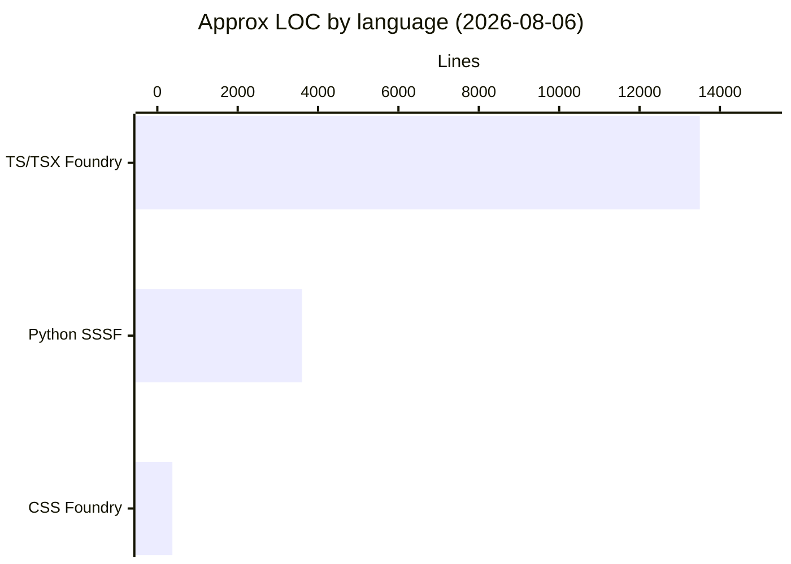
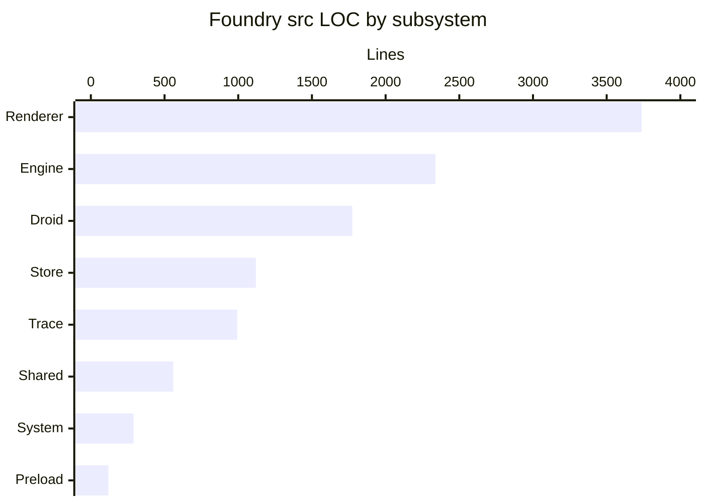

# By the numbers

Snapshot of size, shape, and activity for this repository. Data collected **2026-08-06**. Counts are approximate (whitespace and comments included; `node_modules`, `dist`, and `out` excluded). See [Architecture](overview/architecture.md) for how the pieces fit together, and [Overview](overview/index.md) for product context.

This repo holds two co-located trees: **Foundry** (`apps/desktop/`, the active product) and the **SSSF skill** (`.claude/skills/sssf/`, reference only).

## Size by language

Approximate lines of code (LOC) for the two main bodies of work:

| Language | Where | ~LOC | Role |
|---|---|---|---|
| TypeScript / TSX | `apps/desktop/` (src + tests) | ~13,500 | Foundry app and vitest suite |
| TypeScript (src only) | `apps/desktop/src/` | ~11,700 | Main, preload, renderer, shared |
| TypeScript (tests) | `apps/desktop/tests/` | ~1,500 | Seams against real git + fake-droid |
| CSS | `apps/desktop/src/renderer/design/` | ~375 | Design tokens |
| Python | `.claude/skills/sssf/` (templates, scripts, modules) | ~3,600 | SSSF ADW skill (not linked by the app) |
| Vue / TS visualizer | `.claude/skills/sssf/apps/visualizer/` | templates + small SPA | Polled trace UI for stamped repos |

Config and packaging under `apps/desktop/` (package.json, electron-vite, electron-builder, tsconfig, vitest) are small relative to source and are not charted.

## Source vs tests vs config (Foundry)

| Bucket | Path | ~LOC | Notes |
|---|---|---|---|
| Application source | `apps/desktop/src/` | ~11,700 | Engine, droid, trace, store, system, renderer, shared, preload |
| Tests | `apps/desktop/tests/` | ~1,500 | 7 files, ~94 tests claimed by AGENTS.md |
| Scripts | `apps/desktop/scripts/` | small | Headless `engine:demo`, icon helper |
| Config / packaging | root of `apps/desktop/` | small | Vite, Electron builder, TypeScript, Vitest |

Rough ratio: source is about **8×** the test suite by lines. Tests punch above that weight: they exercise real `mkdtemp` git repos and a scripted droid peer, not mocks of the engine loop.

**TODOs in `apps/desktop/src`:** none found on this date.

## LOC by subsystem (Foundry `src` only)

| Subsystem | Path | ~LOC |
|---|---|---|
| Renderer | `src/renderer/` | 3,737 |
| Engine | `src/main/engine/` | 2,338 |
| Droid harness | `src/main/droid/` | 1,774 |
| Store | `src/main/store/` | 1,120 |
| Trace | `src/main/trace/` | 993 |
| Shared contract | `src/shared/` | 559 |
| System | `src/main/system/` | 290 |
| Preload | `src/preload/` | 119 |
| IPC + bootstrap | `src/main/ipc/`, `main.ts`, `context.ts` | remainder of main |

The UI is the single largest subtree. The factory spine (engine + droid + trace) is comparable in aggregate and carries most of the behavioural complexity. Preload stays deliberately thin: named invoke only, no generic escape hatch.

## Complexity hotspots

Largest TypeScript files in Foundry (line counts from the 2026-08-06 tree):

| File | ~Lines | Why it is large |
|---|---|---|
| `src/main/engine/executor.ts` | 841 | Full run loop: phases, retries, corrections, acceptance, `finish()` |
| `src/main/trace/tracer.ts` | 825 | Single writer for runs, phases, events, envelopes, gates, sessions |
| `src/main/droid/client.ts` | 465 | Long-lived stream-JSON-RPC session over stdio |
| `src/main/ipc/` | ~650 | Renderer capability surface (invoke handlers, split by domain) |

Average size is uneven. Trace is two files that own the whole write path (~500 lines each on average). Engine spreads across nine modules; droid across seven. Renderer spreads across many small screens and components under `components/` and `screens/`, so directory averages there understate any one file.

| Directory | ~LOC | Rough file count | Rough avg LOC / file |
|---|---|---|---|
| `src/main/engine/` | 2,338 | 9 | ~260 |
| `src/main/droid/` | 1,774 | 7 | ~250 |
| `src/main/store/` | 1,120 | 7 | ~160 |
| `src/main/trace/` | 993 | 2 | ~500 |
| `src/main/system/` | 290 | 3 | ~100 |
| `src/shared/` | 559 | 2 | ~280 |
| `src/preload/` | 119 | 1 | 119 |

## Tests

| Suite file | Focus (from AGENTS.md) | ~Count |
|---|---|---|
| `envelopes.test.ts` | zod seams, extraction, correction messages | 12 |
| `boundary.test.ts` | glob matching, three-state allow, revert | 12 |
| `ipc-clone.test.ts` | structured-clone bridge payloads | 6 |
| `gates.test.ts` | each gate's evidence, unknown-gate failure | 19 |
| `droid-client.test.ts` | wire protocol against fake-droid | 24 |
| `executor.test.ts` | run loop against real git temp repos | 21 |
| `fake-droid.ts` | scripted stdio peer (fixture, not a suite) | — |

Total: **~94 tests**, no network and no live model in the loop.

## Built-in product surface

| Kind | Count | Notes |
|---|---|---|
| Builtin agents | 5 | planner, builder, scout, reviewer, documenter (no tester) |
| Builtin pipelines | 7 | from single-agent `prompt` through `full-sdlc` |
| Gates | 6 | artifacts, non-empty files, JSON, diff claims, verdict, command |
| Envelope kinds | several | generic, plan, build, scout, review, document (+ custom fields) |

## Git activity

Default branch: **main**. The history is young and sparse on this date:

| Date | Commit (summary) | What landed |
|---|---|---|
| 2026-08-02 | Initial SSSF skill tree | Python ADWs, cookbooks, Vue visualizer templates |
| 2026-08-06 | Foundry addition | Full Electron app under `apps/desktop/`, PLAN.md, app-side tests |

**Bot-attributed commits:** effectively **0%** of the recorded history (no dependabot/renovate-style commit series observed in this snapshot).

Volume is not a growth curve yet: two product-level landings a few days apart, rather than a long series of incremental merges. Treat LOC above as a cold-start footprint, not a multi-year accumulation.

## What the numbers imply

- Foundry is a **vertical slice**, not a monorepo of many packages: one Electron app, one test harness style, one IPC contract.
- Complexity concentrates in **executor**, **tracer**, and **droid client**, which matches the [architecture](overview/architecture.md) story (code owns the loop; one SQLite writer; observed wire protocol).
- The skill under `.claude/` is real code (~3.6k Python plus visualizer templates) but remains **out of the runtime graph**. Size there should not be mistaken for app debt.

For narrative history rather than tables, see [Lore](lore.md). For odd invariants that numbers cannot show, see [Fun facts](fun-facts.md).
