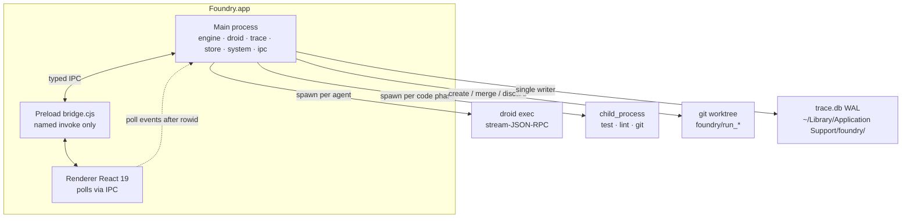
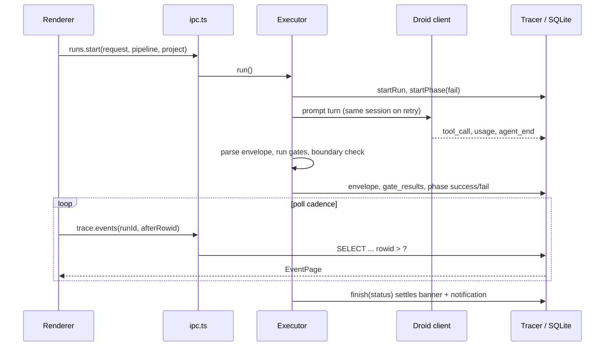

# Architecture

Foundry is a single Electron process tree: a privileged **main** process (Node), a sandboxed **preload** bridge, and a **renderer** (React 19). The factory engine, droid harness, SQLite tracer, and config stores live only in main. The UI never touches disk, git, or droid directly.

## Process topology

## Language breakdown (Foundry app)

Approximate source under `apps/desktop/` (excluding `node_modules`, `dist`, `out`):

| Language | Role | ~Lines |
|---|---|---|
| TypeScript / TSX | App + tests | ~13.5k |
| CSS | Design tokens | ~375 |
| Config YAML / JSON | Build and packaging | small |

The SSSF skill (Python, Vue visualizer templates) lives under `.claude/skills/sssf/` and is not part of the app runtime. See [From SSSF to Foundry](../background/from-sssf-to-foundry.md).

## Main process layout

| Directory | Responsibility |
|---|---|
| `src/main/engine/` | Pipeline executor, envelopes, gates, write boundaries, worktrees, prompts |
| `src/main/droid/` | Long-lived `droid exec` client, protocol, event folding, catalog, one-shot fallback |
| `src/main/trace/` | better-sqlite3 schema + `Tracer` (only writer of run state) |
| `src/main/store/` | JSON-backed settings, roster, pipelines, projects; builtins as seeds |
| `src/main/system/` | Process registry, doctor checks, native notifications |
| `src/main/ipc.ts` | Full invoke/handle surface for the renderer |
| `src/main/main.ts` | Window lifecycle, menu, app bootstrap |

## Shared contract

`src/shared/types.ts` and `src/shared/ipc-contract.ts` are the contract both processes import. If the UI needs a new capability, the channel is added there first, then a handler in `ipc.ts`, then the preload bridge.

## Run data flow

## Invariants that structure the design

- **A phase is born `fail`.** It flips to success only on clean exit, plus (for agent phases) a parsed envelope and green gates.
- **Corrections re-prompt the same live session.** Envelope retries and gate retries have separate budgets.
- **Gates return evidence, not verdicts.** Each gate emits one `GateCheck` per item examined.
- **Write boundaries are enforced after the call** by diffing `git status`, not by trusting the agent.
- **`finish()`** settles status, notification, banner, and `outcome_detail` together.
- Every run gets a git worktree and a `foundry/run_*` branch by default; the base checkout is never touched.

Deeper subsystem pages: [Engine](../systems/engine.md), [Droid harness](../systems/droid.md), [Trace](../systems/trace.md), [Renderer](../systems/renderer.md).
