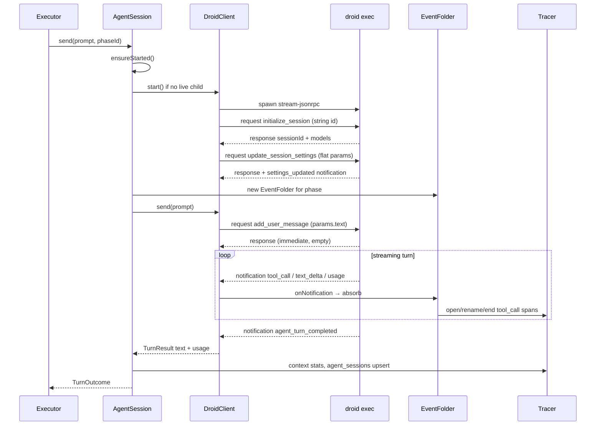
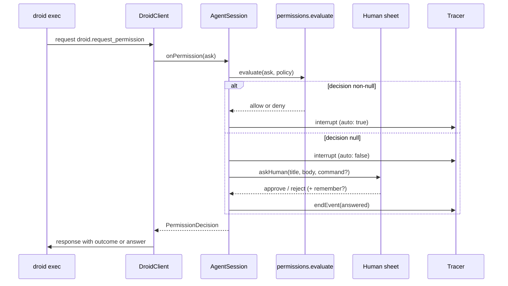
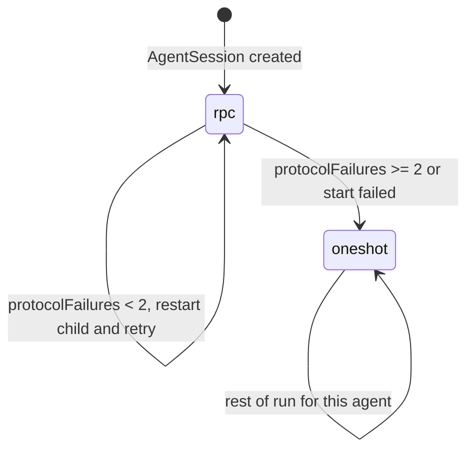

# Droid harness

## Active contributors

Foundry maintainers

## Purpose

> Foundry drives five agent CLIs. This page covers droid's own JSON-RPC transport and the harness around it. The vendor-neutral seam that lets an agent pick Claude Code, Codex, Junie, or Grok instead is documented in [Agent CLIs](clis.md).

The droid harness is Foundry's adapter over Factory's coding-agent CLI (`droid`). It turns a long-lived `droid exec` process into a stable contract for the engine:

```
send(prompt) → { text, usage, reason }
```

The executor cannot tell whether the turn ran over stream-JSON-RPC or the one-shot fallback. Sessions are scoped to one agent for a whole run, start lazily on that agent's first phase, and stay alive so corrections cost one message instead of a cold restart.

This layer owns wire framing, permission policy, event folding into the trace, model and tool catalog discovery, and graceful degradation when the RPC surface flaps. It does not own sequencing, envelope parsing, gates, or write-boundary enforcement. Those live in the [engine](engine.md).

## Directory layout

All paths under `apps/desktop/src/main/droid/`:

| File | Role |
|---|---|
| [`protocol.ts`](../../apps/desktop/src/main/droid/protocol.ts) | Wire types, version constants, request/response builders, notification payloads |
| [`client.ts`](../../apps/desktop/src/main/droid/client.ts) | Long-lived `droid exec` child; JSON-RPC over stdio; turn collector |
| [`agent.ts`](../../apps/desktop/src/main/droid/agent.ts) | Per-agent session lifecycle; RPC vs oneshot mode; policy → human interrupt |
| [`events.ts`](../../apps/desktop/src/main/droid/events.ts) | Folds notification stream into trace rows (one span per `toolUseId`) |
| [`oneshot.ts`](../../apps/desktop/src/main/droid/oneshot.ts) | One process per turn, driven by a [`cli/`](clis.md) adapter. Droid's RPC fallback, and the only path for every other vendor |
| [`catalog.ts`](../../apps/desktop/src/main/droid/catalog.ts) | Droid's model and tool discovery, plus the shared `cliVersion` probe |
| [`permissions.ts`](../../apps/desktop/src/main/droid/permissions.ts) | Policy for `droid.request_permission` and `droid.ask_user` |

Tests that encode the real CLI's quirks:

| File | Role |
|---|---|
| [`tests/fake-droid.ts`](../../apps/desktop/tests/fake-droid.ts) | Scripted stdio peer that rejects plain JSON-RPC, numeric ids, etc. |
| [`tests/droid-client.test.ts`](../../apps/desktop/tests/droid-client.test.ts) | Session lifecycle, turns, labelling, permission policy (24 tests) |

## Key abstractions

### Wire messages (`protocol.ts`)

Every frame on the RPC stream is JSON with a `type` discriminator:

- **`RpcRequest`**: Foundry → droid. Carries `jsonrpc: '2.0'`, `type: 'request'`, Factory version fields, **string** `id`, `method`, optional `params`.
- **`RpcResponse`**: droid → Foundry for a pending call, or Foundry → droid answering a server request (`droid.request_permission` / `droid.ask_user`).
- **`RpcNotification`**: droid → Foundry. Shape is `params: { sessionId?, notification: DroidNotification }`. Turn progress and completion are notifications, not responses.

Version constants currently pinned in protocol:

- `FACTORY_API_VERSION = '1.0.0'`
- `FACTORY_PROTOCOL_VERSION = '1.151.0'`

Important payload types:

| Type | Meaning |
|---|---|
| `TokenUsage` | Input/output/cache/thinking tokens and factory credits |
| `ToolUse` | Streaming tool invocation (`id`, `name`, partial `input`) |
| `SessionSettings` | Flat settings: `modelId`, `reasoningEffort`, `autonomyLevel`, tool id lists |
| `AvailableModel` | Catalog entry returned on session init |
| `InitializeSessionResult` | `sessionId` + settings + available models |
| `ContextStatsResult` | Used / remaining / limit for the context lane bar |

`DroidNotification` covers the live surface: text deltas, `create_message`, `tool_call` / `tool_result`, token usage, working state, and the terminal `agent_turn_completed`.

### Three protocol quirks (load-bearing)

These are observed against the real CLI and deliberately reproduced by `fake-droid`. A naive client gets all three wrong:

1. **`type` discriminator plus Factory versions.** Every message needs `type` (`request` / `response` / `notification`) alongside `jsonrpc` and the Factory API/protocol version fields. A plain JSON-RPC frame is rejected with parse error `-32700`.
2. **Request `id` must be a string.** Numeric ids are rejected the same way (`id: null` error response). Foundry generates ids as `` `f${n}` ``.
3. **Session settings are flat params** on `droid.update_session_settings`. Nested under a `settings` object they are silently ignored. CLI flags like `-m` and `--auto` do not configure an already-open RPC session, so model substitution travels through this method.

Related turn semantics (also load-bearing):

- `droid.add_user_message` takes `params.text` (not `message`) and **returns immediately**. The turn ends when droid emits `agent_turn_completed`.
- `tool_call` is re-emitted for the same `toolUseId` as arguments stream in. The client must fold them into one spanning event.

### `DroidClient` (`client.ts`)

One long-lived child per agent per run:

```
droid exec --input-format stream-jsonrpc --output-format stream-jsonrpc --cwd <worktree> --auto <autonomy>
```

Responsibilities:

- Spawn, line-buffer stdout, dispatch frames.
- Correlate request ids via a `pending` map with per-call timeouts.
- `start()`: `droid.initialize_session` or `droid.load_session`, then `applySettings()`.
- `send(text, timeoutMs)`: `add_user_message` + wait for `TurnCollector` to settle on `agent_turn_completed`.
- Answer server requests for permissions without blocking the whole process tree.
- Degrade on policy-blocked models: retry `update_session_settings` without the model override and emit a `model-warning` event rather than killing the session.
- Prefer committed assistant text from `create_message` over the delta stream when finishing a turn.

`INHERIT_MODEL = 'inherit'` means "do not send a model override; use droid's default."

### `AgentSession` (`agent.ts`)

Adapter the [engine](engine.md) holds in a `Map<agentName, AgentSession>`:

| Concern | Behavior |
|---|---|
| Laziness | No child until the agent's first `send()` |
| Mode | Starts as `rpc`; may fall to `oneshot` |
| Failure budget | `PROTOCOL_FAILURE_LIMIT = 2`. After two protocol failures in a run, switch permanently to oneshot for that agent |
| Permissions | `evaluate()` first; if policy returns null, `askHuman` sheet |
| Tracing | Upserts `agent_sessions`, records the droid process row, logs stderr and fallbacks, refreshes context stats after turns |
| Interrupt / kill | Soft interrupt via RPC; hard kill of the child |

Public turn result for the engine:

```ts
interface TurnOutcome {
  text: string;
  usage: UsageBreakdown;
  reason: string;
}
```

### `EventFolder` (`events.ts`)

Folds the notification stream into [trace](trace.md) rows while a turn is open:

- **`tool_call`**: first frame for a `toolUseId` opens a spanning `tool_call` event with a human-readable label (`bash: bun test`, `read: …/path.ts`). Later frames for the same id rename the row as arguments fill in.
- **`tool_result`**: ends the open span with a truncated result and `isError`.
- **`assistant_text_delta`**: live tail only (ring buffer via `onText`; not stored).
- **Usage notifications**: held for the turn outcome; unreported usage becomes `reported: false`, not zeros that look like free work.
- **`closeDangling`**: if the transport dies mid-tool, open spans end with an error note so the UI never shows a row that never closes.

### `OneShotClient` (`oneshot.ts`)

Fallback when RPC dies twice (or fails to start):

```
droid exec --output-format json --cwd <worktree> --auto <autonomy> [-m model] [-r effort] [--session-id id] <prompt>
```

Each turn is its own process. Session continuity uses `--session-id` when known. Mid-turn tool visibility is gone; `AgentSession` records one spanning `tool_call` event with a note that streaming is unavailable. Envelopes, gates, boundaries, and cost still work under the same `send()` contract. Policy-blocked models retry without `-m`.

### Catalog (`catalog.ts`)

Advisory discovery; droid remains authoritative at turn time.

| Source | Use |
|---|---|
| `droid exec --help` | Model table without a session or network |
| Session `availableModels` | Merge into the help list after RPC init |
| `~/.factory/settings.json` `customModels` | BYOK badges in the picker |
| `droid exec --list-tools -o json` | Tool list for the roster editor |

`loadDroidCatalog` caches for 60 seconds. `invalidateCatalog` runs when the user changes a CLI path in settings. IPC exposes `catalogModels(vendor)` and `catalogTools(vendor)`, both dispatched through the [vendor registry](clis.md); only droid returns a tool list.

### Permission policy (`permissions.ts`)

Why the raw JSON-RPC permission surface exists: too much auto-approve makes autonomy theater; too little stalls unattended runs. Every decision (auto or human) is traced as an `interrupt` event.

| Situation | Decision |
|---|---|
| Read-only tools (`Read`, `Grep`, `Glob`, `LS`, …) | Auto-allow |
| Write tools inside worktree and write boundary, autonomy medium+ | Auto-allow |
| Write tools at autonomy `low` | Escalate to human |
| Write outside write boundary | Auto-deny (no sheet) |
| Write outside the worktree entirely | Escalate to human |
| Command on project allowlist (prefix match) | Auto-allow |
| Command not allowlisted, autonomy `high` | Auto-allow |
| Command not allowlisted, autonomy medium/low | Escalate (sheet can "remember") |
| `droid.ask_user` | Always escalate; only a human answers questions |
| Unknown tool shape | Escalate with params as body |

Server method responses differ:

- `droid.request_permission` → `{ outcome: { outcome: 'allow' \| 'deny', reason? } }`
- `droid.ask_user` → `{ answer: 'yes' \| 'no' }`

## How it works

### Request / response / notification flow



### Permission ask path



### Mode fallback



After a transport failure under the limit, `AgentSession` drops the dead child, restarts RPC (reusing `droidSessionId` via `load_session` when possible), and retries the turn once. A second failure, or a hard start failure, switches to oneshot for the remainder of the run and notifies the executor via `onModeChange` so the run row's `mode` updates.

### Turn text selection

`TurnCollector` (inside `client.ts`) accumulates deltas for the live UI but prefers the committed assistant message from `create_message` when finishing. That is the text the engine parses as an envelope.

## Integration

### Engine

[`executor.ts`](../../apps/desktop/src/main/engine/executor.ts) owns a `Map` of `AgentSession` instances, one per agent name for the run. On each agent phase it:

1. Resolves the roster agent and reuses or creates a session (`sessionFor`).
2. Renders the prompt, writes it under the run files tree, and calls `session.send`.
3. On correction (envelope or gate), re-prompts the **same** session so context is retained.
4. On mode change, writes `runs.mode` through the tracer.
5. Wires `askHuman` for both engineer phases and permission interrupts.
6. Closes or kills sessions when the run finishes or is cancelled.

The harness never decides phase success. It only returns text and usage.

### Trace

The harness is a heavy writer into the [trace](trace.md) (never a reader of its own history for control flow):

| Write | When |
|---|---|
| `agent_sessions` upsert | Start, mode switch, oneshot session id adoption |
| `processes` row (kind `droid`) | RPC child pid known |
| `tool_call` / end | EventFolder folding |
| `interrupt` | Auto policy or human permission sheet |
| `log` / `error` | stderr, protocol errors, fallback notes |
| Context tokens / window | After successful RPC turns via `get_context_stats` |
| `runs.mode` | Through executor when mode changes |

Live assistant text is **not** stored; it is a ring buffer for the phase panel via `onLiveText`.

### Catalog and doctor

- IPC `catalogModels` / `catalogTools` call into `catalog.ts` with the configured droid path.
- Doctor checks use `droidVersion` for presence and version reporting.

### Security

Write boundaries after a phase still belong to the engine (git status diff). Permission policy only gates what the agent may attempt mid-turn. See [security](../security.md) when that page covers autonomy and allowlists, and the write-boundary discussion in [engine](engine.md).

### UI

The renderer never speaks droid. It sees folded events, agent session rows, context occupancy, and interrupt sheets over the named IPC surface only.

## Entry points

| Caller | Entry | Effect |
|---|---|---|
| Executor agent phase | `new AgentSession` / `session.send` | Lazy spawn, turn, fold events |
| Executor cancel / finish | `session.interrupt` / `close` / `kill` | Soft stop or teardown |
| Executor mode callback | `onModeChange` | Persist run mode `rpc` \| `oneshot` |
| IPC settings | `invalidateCatalog` | Drop model cache when droid path changes |
| IPC catalog | `loadCatalog` / `loadTools` | Roster and picker data |
| Doctor | `droidVersion` | Binary health |
| Tests | `writeFakeDroid()` + `DroidClient` | Protocol and policy without a real model |

There is no renderer entry into this package.

## Key source files

| Path | Notes |
|---|---|
| [`apps/desktop/src/main/droid/protocol.ts`](../../apps/desktop/src/main/droid/protocol.ts) | Quirks documented at file top; frame builders; notification union |
| [`apps/desktop/src/main/droid/client.ts`](../../apps/desktop/src/main/droid/client.ts) | Child process, pending map, TurnCollector, server-request answers |
| [`apps/desktop/src/main/droid/agent.ts`](../../apps/desktop/src/main/droid/agent.ts) | Session lifecycle, failure budget, oneshot switch, policy bridge |
| [`apps/desktop/src/main/droid/events.ts`](../../apps/desktop/src/main/droid/events.ts) | `toolUseId` folding, labels, usage honesty |
| [`apps/desktop/src/main/droid/oneshot.ts`](../../apps/desktop/src/main/droid/oneshot.ts) | Per-turn `exec -o json` fallback |
| [`apps/desktop/src/main/droid/catalog.ts`](../../apps/desktop/src/main/droid/catalog.ts) | Help-parse models, tools list, custom model badges |
| [`apps/desktop/src/main/droid/permissions.ts`](../../apps/desktop/src/main/droid/permissions.ts) | Auto vs escalate matrix |
| [`apps/desktop/src/main/engine/executor.ts`](../../apps/desktop/src/main/engine/executor.ts) | Owns sessions; corrections re-prompt live sessions |
| [`apps/desktop/src/main/trace/tracer.ts`](../../apps/desktop/src/main/trace/tracer.ts) | `upsertAgentSession`, process rows, event spans |
| [`apps/desktop/tests/fake-droid.ts`](../../apps/desktop/tests/fake-droid.ts) | Quirk-faithful stdio peer; scenarios for happy path, tools, die mid-turn, model reject, permission ask |
| [`apps/desktop/tests/droid-client.test.ts`](../../apps/desktop/tests/droid-client.test.ts) | Contract tests for the harness |

## Related pages

- [Architecture](../overview/architecture.md) — process topology and where droid sits
- [Engine](engine.md) — run loop that owns `AgentSession`
- [Trace](trace.md) — event rows and `agent_sessions`
- [Runs and traces](../features/runs-and-traces.md) — operator-facing live view
- [Security](../security.md) — autonomy, allowlists, and human interrupts
- [Glossary](../overview/glossary.md) — droid, oneshot, correction
- [Patterns and conventions](../how-to-contribute/patterns-and-conventions.md) — protocol quirks in contributor form
