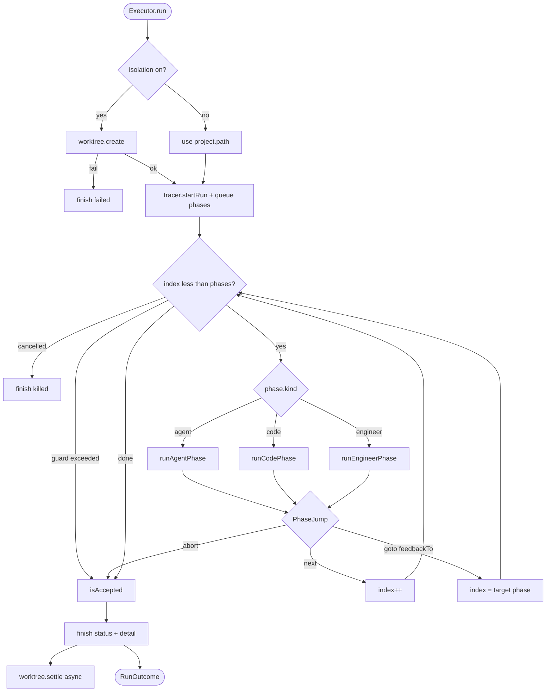
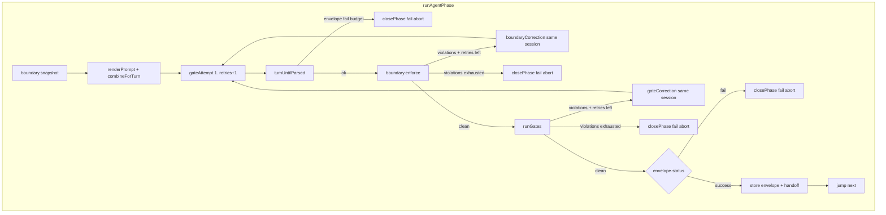

# Engine

> Active contributors: IndyDevDan (original SSSF ideas); Foundry maintainers

## Purpose

The engine is Foundry's deterministic pipeline runner. It owns sequencing, retries, acceptance, write-boundary enforcement, and worktree lifecycle. Agents do work inside one phase; they never decide whether that phase or the run succeeded.

Implementation lives under `apps/desktop/src/main/engine/`. The UI starts a run through `RunRegistry` (`registry.ts`); the registry builds an `Executor` and lets `run()` drive the loop against a real git repo and (for agent phases) the [droid harness](droid.md).

Related product views: [envelopes and gates](../features/envelopes-and-gates.md), [worktrees](../features/worktrees.md). Doctrine: [design invariants](../background/design-invariants.md). Process placement: [architecture](../overview/architecture.md).

## Directory layout

| Path | Role |
|---|---|
| `apps/desktop/src/main/engine/executor.ts` | Run loop: phase dispatch, retries, acceptance, `finish()` |
| `apps/desktop/src/main/engine/registry.ts` | Live runs, interrupts, kill, relaunch sweep |
| `apps/desktop/src/main/engine/envelopes.ts` | Zod schemas, extract/parse, correction messages, feedback envelope |
| `apps/desktop/src/main/engine/gates.ts` | Six built-in gates, evidence model, unknown-gate failure |
| `apps/desktop/src/main/engine/boundary.ts` | Write-boundary snapshot / enforce / revert / correction |
| `apps/desktop/src/main/engine/prompts.ts` | Template variables, render, missing-input append, combine for turn |
| `apps/desktop/src/main/engine/commands.ts` | Subprocess runner for code phases and gates; builtins |
| `apps/desktop/src/main/engine/worktree.ts` | Create, settle (merge policy), discard, orphan discovery |
| `apps/desktop/src/main/engine/git.ts` | Typed git surface (status, worktree, merge, revert) |
| `apps/desktop/tests/executor.test.ts` | End-to-end loop against real git + scripted droid |
| `apps/desktop/tests/envelopes.test.ts` | Parse, extract, corrections |
| `apps/desktop/tests/gates.test.ts` | Gate evidence and unknown gates |
| `apps/desktop/tests/boundary.test.ts` | Globs, three-state allow, revert |

## Key abstractions

| Abstraction | Where | Meaning |
|---|---|---|
| `Executor` | `executor.ts` | One pipeline run: sessions, envelopes, command results, feedback map, worktree handle |
| `ExecutorDeps` | `executor.ts` | Injected tracer, settings (retries, autonomy, droid path), agents, project, pipeline, `askHuman` |
| `RunRegistry` | `registry.ts` | Owns live executors, interrupt queue, live text buffer, orphan-run sweep |
| `PhaseDef` | `shared/types.ts` | Agent / code / engineer step: gates, command, retries, `feedbackTo` |
| `PhaseJump` | `executor.ts` | Control flow after a phase: `next`, `goto` (feedback), or `abort` |
| `Envelope` | `envelopes.ts` | Validated agent report; context between phases |
| `GateReport` / `GateCheck` | `gates.ts`, `types.ts` | Evidence per examined item; pass is derived from checks |
| `WriteBoundary` | `types.ts` | `null` unrestricted (minus protected), `[]` read-only, or path/glob allowlist |
| `WorktreeHandle` | `worktree.ts` | Path, branch `foundry/<runId>`, base ref, branch-point SHA |
| `Acceptance` | `types.ts` | How the run becomes `accepted` vs not after the phase loop |
| `RenderContext` | `prompts.ts` | Request, worktree, handoffs, prior envelopes, repair feedback |

## How it works

### Entry: registry starts an executor

`RunRegistry.start` (`registry.ts`) allocates a `run_*` id, opens the project's [tracer](trace.md), constructs `Executor` with settings (`envelopeRetries`, `gateRetries`, autonomy, turn timeout, droid path), and fire-and-forgets `executor.run()`. Interrupts (engineer phases and droid permission prompts) go through `askHuman` → a pending interrupt the UI answers.

Note: `gateRetries` is plumbed from settings into `ExecutorDeps`, but **gate/boundary retry count for agent phases is `phase.retries`**, not the settings field. Envelope parse retries use `deps.envelopeRetries`. See `runAgentPhase` and `turnUntilParsed` in `executor.ts`.

### Run start: isolation then queue

`Executor.run()` (`executor.ts`):

1. **Worktree** (when `pipeline.isolation !== false && project.isolation`): `worktreeLib.create` adds `.foundry-worktrees/<runId>` on branch `foundry/<runId>` from `project.baseRef` (`worktree.ts`, `git.ts`). Failure finishes the run as `failed` with a worktree error event. Isolation product details: [worktrees](../features/worktrees.md).
2. **`tracer.startRun`** records project, pipeline snapshot, request, engineer, worktree path/branch, base ref, mode.
3. Creates `.foundry-handoff/` under the cwd (worktree or project root).
4. **Queues every phase** via `tracer.queuePhase` so the UI waterfall can show dashed future steps. Owner is the agent name, `"code"`, or the engineer name.
5. Enters the phase index loop with a **loop guard** (`phases.length + 32`) so a non-converging `feedbackTo` cycle cannot run forever.

### Phase kinds

Dispatch is `runPhase` → one of three handlers (`executor.ts`).

#### Agent

`runAgentPhase`:

1. Resolve agent from the roster; missing agent aborts.
2. Reuse or create `AgentSession` for that agent name (`sessionFor` → [droid](droid.md)). Same session for every correction and every gate attempt.
3. `boundary.snapshot(cwd)` of git status before work.
4. Render prompt (`prompts.ts`) and write it under the run file store.
5. **Outer loop**: gate/boundary attempts, count = `(phase.retries ?? 0) + 1`.
6. **Inner loop** (`turnUntilParsed`): send turn; parse envelope; on failure, correction re-prompt in-session up to `envelopeRetries + 1` total attempts.
7. **Write boundary** (`boundary.enforce`): new paths since snapshot classified; unauthorized paths reverted; violations can consume a gate attempt with `boundaryCorrection`.
8. **Gates** (`runPhaseGates` → `gates.runGates`): each gate emits checks; failures become `gateCorrection` for the next attempt.
9. If gates clean and `envelope.status === 'fail'`, the phase fails (agent-reported failure is still a code decision).
10. On success: store envelope by phase name, `writeHandoff`, `closePhase(..., 'success')`, jump `next`.

#### Code

`runCodePhase`:

1. `resolveCommand` (see below).
2. Skip path closes phase as `skipped` (e.g. resolved skip; currently used when resolution marks skip).
3. `runCommand` (`commands.ts`) with timeout, process registration for kill, output tail.
4. Exit 0 → success.
5. `optional` → `skipped`, continue.
6. **`feedbackTo`**: if under `feedbackRetries` budget, build `feedbackEnvelope` from command + tail, stash text in `this.feedback` for the target phase name, close phase fail, jump `goto` that phase. Budget exhausted → abort.
7. Otherwise abort with exit code.

#### Engineer

`runEngineerPhase`: raises interrupt via `askHuman`, records approve/reject. Reject aborts. Optional notes become a synthetic success envelope so later phases can read them like agent output.

### Run loop (mermaid)

### Agent turn and acceptance detail

### Envelopes: parse or correct

`envelopes.ts` holds kind schemas (`generic`, `plan`, `build`, `scout`, `review`, `document`) plus optional custom fields from the agent def. `exampleFor` builds the prompt JSON example from the same schema shape the parser uses, so the triad (type / example / parse) cannot drift.

`extractJson` prefers the last fenced or balanced JSON object in the reply so prose-before-JSON still works. `parseEnvelope` runs zod `safeParse`; failures produce a specific `problem` string.

`correctionMessage` names the problem, restates `exampleFor`, and asks for JSON only. That string is the next `session.send` on the **same** live session (`turnUntilParsed`).

`feedbackEnvelope` wraps a failed code command (phase name, command, exit, output tail) so repair prompts can inject evidence without the agent opening a log file.

Product view: [envelopes and gates](../features/envelopes-and-gates.md). Primitive: [envelope](../primitives/envelope.md) (if present).

### Gates: evidence, not bare verdicts

`gates.ts` registers six functions in `GATES`:

| Gate | What it checks |
|---|---|
| `artifacts_exist` | Each `envelope.artifacts` path exists under cwd |
| `files_non_empty` | Declared artifacts that exist have size (dirs ok) |
| `json_parses` | Declared `*.json` artifacts parse |
| `diff_matches_claims` | Claimed `changed_files` exist; unclaimed git changes fail |
| `verdict_consistent` | Review cannot approve with blocking/unmet findings; reject must name a problem |
| `command_passes` | Config `argv` exits 0 (generalised SSSF tests_pass) |

`runGates` unknown name → failed check `"unknown gate: nothing verified it"`. `violationsOf` flattens failed checks into correction strings. Green gates still carry per-item notes (sizes, path matches), which the tracer records for the UI.

Gate context cwd is the worktree (or project path), and `changedPaths` is current git status for claim checks.

### Write boundaries

`boundary.ts` is the inner safety envelope (droid `--auto` / autonomy is the outer one).

- **Always protected**: `.foundry/`, `.git/`, `.foundry-worktrees/`, plus `project.protectedPaths`.
- **Three-state allow**: `writes === null` unrestricted minus protected; `[]` read-only; list = allowlist with narrow globs (`*`, `**`).
- After each agent attempt: diff git status vs pre-phase snapshot; revert unauthorized new paths; emit violations as evidence; optional correction turn.

### Command resolution

`resolveCommand` in `executor.ts`:

| `CommandSpec` | Resolution |
|---|---|
| `{ argv: string[] }` | Use as-is |
| `{ ref: string }` | Look up `project.commands` by name; missing → fail with Settings hint |
| `{ builtin: 'git_status' \| 'noop' }` | `BUILTIN_ARGV` in `commands.ts` |
| `{ builtin: 'git_commit', messageFrom? }` | Stage-all + commit if index non-empty; message from `resolveEnvelopeRef` (e.g. `envelope:build.commit_message`) |

`git_commit` is implemented as `sh -c 'git add -A && git diff --cached --quiet || git commit -m ...'` so empty commits do not fail the phase (`gitCommitArgv`).

`runCommand` captures a bounded stdout/stderr tail, supports timeout kill trees, and registers PIDs so `RunRegistry.kill` / process control can stop children.

### Prompt rendering

`prompts.ts`:

1. `renderTemplate` substitutes `{{request}}`, `{{run_id}}`, `{{worktree}}`, `{{handoff_dir}}`, `{{handoff_files}}`, `{{feedback}}`, and `{{envelope:phase[.field]}}`.
2. `appendMissingInputs` adds sections for `phase.prompt.inputs` not already referenced in the agent user prompt, so pipeline-declared inputs are not dropped by prompt edits. Repair feedback is force-appended when present and not covered.
3. Appends a **Report** section with `exampleFor(envelopeKind, customFields)`.
4. `combineForTurn` joins system + `---` + user because droid appends rather than replaces the system prompt; persona rides with the turn.

### Acceptance and `finish()`

After the phase loop (and after abort detail, if any), `isAccepted()` applies `pipeline.acceptance` (`executor.ts`):

| Kind | Criterion |
|---|---|
| `all_phases_pass` | Every phase `success` or `skipped` |
| `last_phase_pass` | Final phase `success` |
| `phase_flag` + `passed` | Named phase success; optional command result exit 0 |
| `phase_flag` + `approved` | Named phase success and envelope `approved === true` |
| `envelope_status` | Named phase success and envelope `status === 'success'` |

`finish(status, detail)`:

1. `tracer.finishRun` (status + `outcome_detail` together; see [trace](trace.md)).
2. If a worktree exists, `worktree.settle`: non-accepted keeps worktree; accepted respects `project.mergePolicy` (`never` / `ask` / `auto` merge via `git.ts`, with base-moved safety).
3. `onRunFinished` callback; returns `RunOutcome`.

Terminal run statuses: `accepted`, `rejected` (acceptance failed or early abort after phases), `failed` (e.g. worktree create), `killed` (cancel).

### Feedback_to loops

Code phases set `feedbackTo` + `feedbackRetries` (builtins often point `test` → `build` with retries 2; `builtin-pipelines.ts`). Failure under budget:

1. `feedbackEnvelope` text stored under the **target** phase name in `this.feedback`.
2. Phase jumps back via `goto`; that agent phase re-renders with `{{feedback}}` / appended feedback section.
3. Same agent session continues (prior context + new repair message).
4. Loop guard and per-phase feedback counters prevent infinite oscillation.

### Cancel and crash hygiene

- `Executor.cancel` sets a flag and kills open agent sessions.
- `RunRegistry.kill` cancels live executors and `killRun` for child processes; leftover `running` rows from a previous process can be force-finished.
- `RunRegistry.sweep` finalises orphaned `running` rows whose engine PIDs are gone (relaunch safety).

## Integration points

| Direction | Partner | Contract |
|---|---|---|
| In | IPC / UI via `RunRegistry.start` | Project, pipeline, agents, request string |
| Out | [Trace](trace.md) | `startRun`, queue/begin/close phase, events, envelopes, gates, usage, `finishRun` |
| Out | [Droid](droid.md) | `AgentSession.send` / close; mode and permission interrupts |
| Out | Git / worktree | Isolation at start; boundary and claim diffs; merge on settle |
| In | Human | Engineer phases and tool-permission interrupts via `askHuman` |
| In | Settings / project | droid path, autonomy, retry budgets, commands, protected paths, merge policy |
| Out | Run file store (tracer) | Prompts, raw JSONL, envelope dumps, command logs, handoff copies |

The renderer never calls the engine directly; it starts runs and polls events ([architecture](../overview/architecture.md)).

## Entry points for modification

| Goal | Start here |
|---|---|
| Change phase order control or acceptance | `executor.ts` (`run`, `isAccepted`, `PhaseJump`) |
| New phase kind | `PhaseKind` in `shared/types.ts` + `runPhase` switch + tests in `executor.test.ts` |
| New envelope kind or field | `envelopes.ts` schemas + `exampleFor` hints + agent/pipeline builtins |
| New gate | Register in `GATES` / `GATE_DESCRIPTIONS` in `gates.ts`; cover in `gates.test.ts` |
| Boundary rules or globs | `boundary.ts` + `boundary.test.ts` |
| Template tokens or prompt assembly | `prompts.ts` (`TEMPLATE_VARIABLES`, `renderPrompt`) |
| Builtins for code phases | `BUILTIN_ARGV` in `commands.ts` + `resolveCommand` |
| Isolation / merge policy | `worktree.ts`, `git.mergeBranch` |
| Live run lifecycle, interrupts, kill | `registry.ts` |
| Seed pipelines that exercise the loop | `store/builtin-pipelines.ts` |

New engine behaviour should follow existing tests: real git temp repos + scripted droid (`tests/executor.test.ts`, `tests/fake-droid.ts` patterns). No network, no model in the loop.

## Key source files

| File | Lines (approx) | Notes |
|---|---|---|
| `apps/desktop/src/main/engine/executor.ts` | ~841 | Core run loop and phase handlers |
| `apps/desktop/src/main/engine/registry.ts` | ~270 | Live run ownership |
| `apps/desktop/src/main/engine/envelopes.ts` | ~256 | Typed seams + corrections |
| `apps/desktop/src/main/engine/gates.ts` | ~284 | Evidence gates |
| `apps/desktop/src/main/engine/boundary.ts` | ~113 | Post-hoc write enforcement |
| `apps/desktop/src/main/engine/prompts.ts` | ~156 | Prompt render |
| `apps/desktop/src/main/engine/commands.ts` | ~117 | Code-phase subprocess |
| `apps/desktop/src/main/engine/worktree.ts` | ~123 | Per-run isolation |
| `apps/desktop/src/main/engine/git.ts` | ~186 | Git CLI surface |
| `apps/desktop/src/shared/types.ts` | (pipeline section) | `PhaseDef`, `Acceptance`, `CommandSpec` |
| `apps/desktop/tests/executor.test.ts` | ~21 cases | Repair loop, boundary, envelope fail, engineer |
| `apps/desktop/scripts/engine-demo.ts` | headless demo | `npm run engine:demo` |

## See also

- [Droid harness](droid.md)
- [Trace](trace.md)
- [Envelopes and gates (feature)](../features/envelopes-and-gates.md)
- [Worktrees (feature)](../features/worktrees.md)
- [Design invariants](../background/design-invariants.md)
- [Architecture](../overview/architecture.md)
- [Glossary](../overview/glossary.md)
- Primitives: [phase](../primitives/phase.md), [envelope](../primitives/envelope.md), [gate](../primitives/gate.md), [pipeline](../primitives/pipeline.md)
