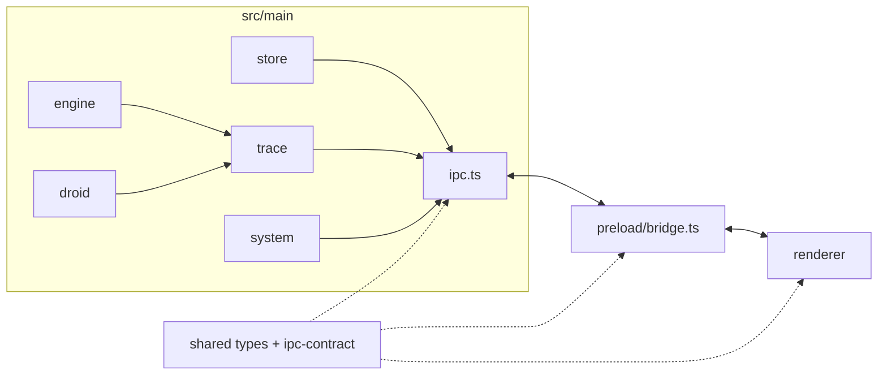

# Systems

Active contributors: Foundry core

## Purpose

This section documents the **privileged and UI subsystems** of Foundry: how the main process stores config, writes the trace, talks to the renderer, and keeps the machine tidy, and how the React shell consumes that surface. Feature behaviour (pipelines, worktrees, envelopes) is covered under [features](../features/index.md). The process-level picture lives in [Architecture](../overview/architecture.md).

Foundry's main process owns everything that can touch the disk, git, droid, or the network. The renderer only polls and invokes named channels. The pages below map that split into packages you can open in `apps/desktop/src/`.

## Layout

## Pages

| Page | What it owns |
|---|---|
| [Engine](engine.md) | Deterministic pipeline runner: phases, envelopes, gates, write boundaries, worktrees |
| [Agent CLIs](clis.md) | The five-vendor adapter seam: argv, parse, autonomy tiers, per-CLI config |
| [Droid harness](droid.md) | Long-lived `droid exec` client, protocol quirks, event folding, catalog |
| [Trace](trace.md) | Per-project SQLite (WAL), single writer, rowid cursor poll, run file mirror |
| [Store](store.md) | JSON config: settings, roster, pipelines, projects; builtins as seeds |
| [IPC and preload](ipc-and-preload.md) | Named invoke surface, handlers, sandboxed bridge, `plain()` clone rule |
| [System services](system-services.md) | Doctor checks, native notifications, process registry and orphan sweep |
| [Renderer](renderer.md) | React shell, screens, stores, derive, design tokens; never disk/git/droid |

## How the systems fit a run

1. **Store** supplies the pipeline, agents, and project commands for a start request.
2. **Engine** sequences phases; the agent's **CLI** (or code commands) do the work inside one phase.
3. **Trace** records every start, tool span, envelope, gate check, and finish.
4. **System** services notify on outcomes, track child PIDs, and heal orphans on relaunch.
5. **IPC / preload** expose a fixed API; the **renderer** polls the same event query for live view and history.

## Related

- [Architecture](../overview/architecture.md)
- [Data models](../reference/data-models.md) (when present)
- [Features](../features/index.md)
- [Patterns and conventions](../how-to-contribute/patterns-and-conventions.md)

## Entry points

| Concern | Start here |
|---|---|
| App bootstrap | `apps/desktop/src/main/main.ts` |
| Handler wiring | `apps/desktop/src/main/ipc.ts` |
| Shared contract | `apps/desktop/src/shared/ipc-contract.ts`, `types.ts` |
| UI shell | `apps/desktop/src/renderer/App.tsx` |

## Key source files

| Path | Role |
|---|---|
| `apps/desktop/src/main/` | Privileged process: engine, droid, trace, store, system, ipc |
| `apps/desktop/src/preload/bridge.ts` | Context-isolated named bridge |
| `apps/desktop/src/renderer/` | React 18 UI |
| `apps/desktop/src/shared/` | Types and IPC channel names shared by both sides |
