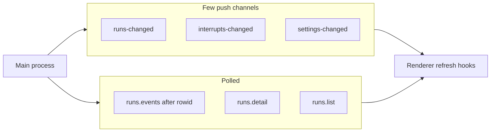

# IPC and preload

Active contributors: Foundry core (`ipc-contract.ts`, `ipc.ts`, `preload/bridge.ts`)

## Purpose

The renderer is sandboxed: no Node, no direct disk, no git, no droid. Its entire capability surface is a **named invoke list** shared by both processes. There is no generic `invoke(channel, ...)` escape hatch and no `remote` module. If the UI needs something new, the channel is added to the contract first, then a handler, then the bridge.

Almost everything is request/response. A handful of **broadcast** events tell the UI to refresh; the trace itself is still **polled** by rowid, not pushed event-by-event.

## Layout

```
src/shared/ipc-contract.ts   # channel names + FoundryApi types
src/main/ipc.ts              # ipcMain.handle for every channel
src/preload/bridge.ts        # contextBridge → window.foundry
src/renderer/api.ts          # plain() wrapper around window.foundry
```

Main registers handlers once at startup (`registerIpc(ctx)` from `main.ts`). Preload is bundled as **CJS** (`bridge.cjs`) because sandboxed preloads cannot be ESM.

## Key abstractions

### `FoundryApi`

Typed namespaces exposed to the renderer:

| Namespace | Capabilities (summary) |
|---|---|
| `settings` | get, patch |
| `projects` | list, add (folder dialog), save, remove, export, tryCommand, check, reveal |
| `roster` | list, save, remove, duplicate, reset |
| `pipelines` | list, save, remove, duplicate, validate, dryRun, reset |
| `catalog` | models, tools, gates, templateVariables |
| `runs` | start, list, detail, events (cursor), liveTail, promptFor, kill, archive, worktree merge/discard/open |
| `interrupts` | list, answer |
| `doctor` | run |
| `maintenance` | orphan worktrees, remove worktree, retention, compact |
| `app` | openExternal, assetUrl, version |
| `on` | subscribe to `runs-changed`, `interrupts-changed`, `settings-changed` |

Payload helper types live beside the API: `RunDetail`, `EventPage`, `SaveResult`, `WorktreeAction`, and so on.

### `IPC` constant map

String channel names (`settings:get`, `runs:events`, `event:runs-changed`, …) are defined once so renaming cannot silently desync preload and main.

### Preload bridge

Each method is `ipcRenderer.invoke(channel, ...args)`. Push subscriptions use `ipcRenderer.on` for the three event channels. A separate `window.foundryMenu` exposes one-way menu commands (`menu:settings`, `menu:new-run`, …) that the renderer maps to navigation.

### `plain()` clone rule

Electron IPC uses the structured clone algorithm. Proxies, class instances, and accessor-only objects throw on send; the failure often lands in an un-awaited promise, so the only symptom is a button that appears to do nothing.

`src/renderer/api.ts` routes **every argument** through `plain()` (JSON round-trip) via a recursive `guard` on `window.foundry`. Call sites do not need to remember to clone.

## How it works

### Adding a capability

1. Declare the method and payload types on `FoundryApi` in `ipc-contract.ts`.
2. Add the channel string to `IPC`.
3. Implement `ipcMain.handle` in `ipc.ts` using `AppContext`.
4. Wire the same name on the preload `api` object.
5. Call it from the renderer only through `api` from `api.ts`.

### Handler patterns in `ipc.ts`

- Handlers receive plain arguments and return plain data (or small result objects with `ok` / `issues`).
- Project-scoped trace access goes through `tracerOf(projectId)` so missing projects return empty pages, not throws.
- Mutating settings, roster, pipelines, or projects broadcasts `settings-changed` (or `runs-changed` for run mutations).
- Run start validates the pipeline with the scoped roster and command names **before** starting, so blocking errors appear at the button, not mid-phase.
- Dry-run renders prompts with placeholder envelopes for earlier phases and spends no model tokens.
- External URLs and asset paths are resolved in main so the renderer never needs filesystem layout.

### Push vs poll



Trace live tails (`runs.liveTail`) are a separate short text buffer for the open phase drawer, not a replacement for the event cursor.

## Integration

| Side | Responsibility |
|---|---|
| [Store](store.md) | Settings, projects, roster, pipelines CRUD |
| [Trace](trace.md) | Run list/detail/events/prompt/archive |
| [Engine](engine.md) via registry | start, kill, interrupts, live tail |
| [System services](system-services.md) | doctor, maintenance, notifications triggered on run finish in context |
| [Renderer](renderer.md) | Sole consumer of `window.foundry` |

Window bootstrap in `main.ts` loads the preload path, enables `contextIsolation`, disables `nodeIntegration`, and enables `sandbox: true`.

## Entry points

| Symbol | File |
|---|---|
| `FoundryApi`, `IPC` | `apps/desktop/src/shared/ipc-contract.ts` |
| `registerIpc` | `apps/desktop/src/main/ipc.ts` |
| `contextBridge.exposeInMainWorld('foundry', api)` | `apps/desktop/src/preload/bridge.ts` |
| `export const api = guard(window.foundry)` | `apps/desktop/src/renderer/api.ts` |
| `AppContext.broadcast` | `apps/desktop/src/main/context.ts` |

## Key source files

| Path | Role |
|---|---|
| `apps/desktop/src/shared/ipc-contract.ts` | Contract: channels, API types, page shapes |
| `apps/desktop/src/shared/types.ts` | Domain types carried over IPC |
| `apps/desktop/src/main/ipc.ts` | All invoke handlers |
| `apps/desktop/src/main/context.ts` | Shared dependencies and broadcast |
| `apps/desktop/src/main/main.ts` | Window + preload path + `registerIpc` |
| `apps/desktop/src/preload/bridge.ts` | Sandboxed bridge |
| `apps/desktop/src/renderer/api.ts` | `plain()` guard |
| `tests/ipc-clone.test.ts` | Payloads survive structured clone |

## Related

- [Trace](trace.md) (event cursor)
- [Store](store.md)
- [Renderer](renderer.md)
- [Architecture](../overview/architecture.md)
- [Patterns and conventions](../how-to-contribute/patterns-and-conventions.md)
