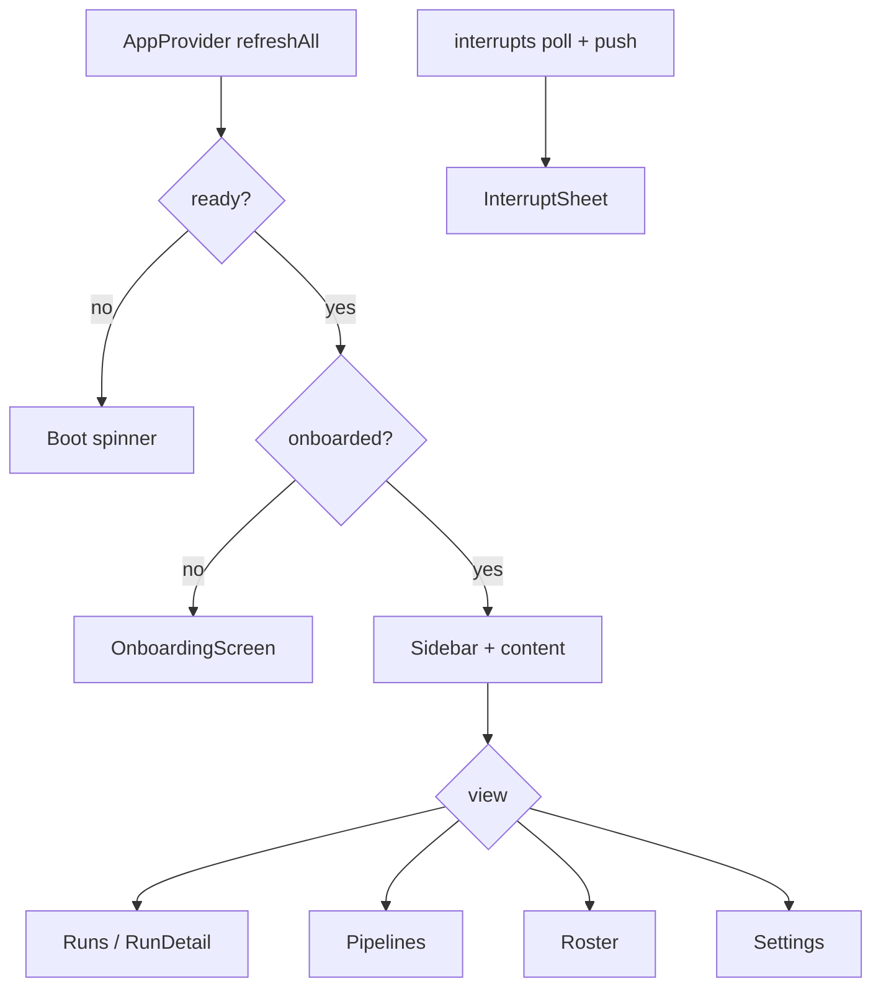

# Renderer

Active contributors: Foundry core (`src/renderer/`)

## Purpose

The renderer is a **React 18 shell** for operators: start and watch runs, edit roster and pipelines, configure projects, and inspect phase evidence. It never opens SQLite, never shells out to git, and never talks to droid. Every privileged action goes through the named [IPC bridge](ipc-and-preload.md). Transport is **poll, not push**: run detail and event history share one rowid cursor query.

## Layout

```
src/renderer/
  main.tsx / App.tsx          # bootstrap and shell
  api.ts                      # plain()-guarded window.foundry
  derive.ts                   # cost/duration/model from events
  format.ts                   # display helpers
  design/tokens.css           # visual contract
  stores/app.tsx              # settings, projects, roster, pipelines
  stores/run.tsx              # run list + live run view
  screens/                    # top-level views
  components/                 # waterfall, drawers, editors, chrome
```

Entry HTML loads the bundle; design tokens apply globally. The window chrome (hidden inset title bar, vibrancy) is owned by main; the renderer paints a drag region and sidebar.

## Key abstractions

### Screens

| Screen | Role |
|---|---|
| `OnboardingScreen` | First-run doctor + settings until `onboarded` |
| `RunsScreen` | Project run list, start run, open detail |
| `RunDetailScreen` | Live/history detail: ribbon, waterfall, drawer, outcome |
| `PipelinesScreen` | Pipeline designer (graph, phase editor, dry-run) |
| `RosterScreen` | Agent editor (prompts, model, boundaries) |
| `SettingsScreen` | General settings, project commands, doctor, maintenance |

`App.tsx` chooses the main view (`runs` | `pipelines` | `roster` | `settings`), overlays onboarding when needed, and mounts a global `InterruptSheet` for the first pending interrupt.

### Stores

**`AppProvider` / `useApp`** (`stores/app.tsx`):

- Loads settings, projects, scoped roster and pipelines.
- Selected project id persisted in `localStorage`.
- Subscribes to `settings-changed` and `interrupts-changed` push events.
- Exposes `patchSettings`, `agentByName`, `pipelineById`, `agentColor`.

**`useRun` / `useRunList`** (`stores/run.tsx`):

- **`useRun`**: polls `runs.detail` and `runs.events(afterRowid)` on a timer. Live runs use `settings.pollCadenceMs` (default 500 ms); finished runs slow to 3 s. Appends events and advances `cursor`. Groups events, envelopes, and gates by phase id for the UI.
- **`useRunList`**: polls the project run list while any run is live.

There is no Redux or external data library: React state + hooks + the IPC API.

### Derive (keep the trace normalised)

`derive.ts` computes what must not be stored as phase columns:

| Function | Source |
|---|---|
| `usageFor(events)` | Sums `agent_end` payload usage across turns (retries stay visible) |
| `phaseDuration` / `runDuration` | Started/ended timestamps |
| `modelFor(events)` | Model from `agent_start` payload |

Unreported usage stays unreported (`reported` flag), never silently zeroed in a misleading total.

### Design tokens

`design/tokens.css` is the visual contract: surfaces, lines, text, accents, status colours, type scale, spacing, radii. Status greens/reds/ambers are the brightest signals on a dark base. Component CSS should use variables (`var(--cyan)`, `var(--status-fail)`, …) so waterfall lanes and badges cannot drift.

### Components (high signal)

| Component | Role |
|---|---|
| `Sidebar` | Project picker and navigation |
| `Waterfall` | Swim-lane timeline of phases and marked events |
| `PhaseDrawer` | Tabs: timeline, envelope, gates, prompt (prompt loaded on demand) |
| `OutcomeBanner` | Terminal run status and detail |
| `PipelineGraph` / `PipelineRibbon` | Pipeline structure for designer and run header |
| `PhaseEditor` / `BoundaryEditor` | Edit phase fields and write globs |
| `CostTable` | Per-phase cost from derived usage |
| `InterruptSheet` | Answer engineer/permission interrupts |
| `DryRunSheet` / `PromptPreview` | Inspect prompts without spending |
| `DoctorList` | Environment and project check results |
| `ModelPicker`, `StatusBadge`, `AgentAvatar`, `JsonView`, `EmptyState` | Shared chrome |

## How it works

### Shell flow



Menu commands from main (`foundryMenu`) switch views or open add-project / new-run without giving the renderer filesystem access.

### Watching a run

1. User opens a run id → `RunDetailScreen` → `useRun(projectId, runId)`.
2. Each tick fetches detail (phases, envelopes, gates, sessions, live flag) and an event page after the cursor.
3. `Waterfall` paints phase bars from timestamps; selecting a phase fills `PhaseDrawer`.
4. Drawer timeline uses events; envelope and gate tabs use rows from detail; prompt tab calls `runs.promptFor` once (large text, not polled).
5. While `live`, cadence is fast; when the run finishes, detail shows terminal status and `OutcomeBanner` reflects `finishRun` settlement.

### Never privileged

The renderer must not:

- Import `fs`, `child_process`, or better-sqlite3
- Construct paths into Application Support or worktrees for I/O
- Spawn or configure droid

Reveal/open worktree/open external are IPC calls that main implements with `shell` and existence checks.

## Integration

| System | Renderer relationship |
|---|---|
| [IPC and preload](ipc-and-preload.md) | Sole I/O path (`api`, `menu`) |
| [Trace](trace.md) | Event cursor + detail queries; derive from events |
| [Store](store.md) | Settings, roster, pipelines, projects via IPC |
| [System services](system-services.md) | Doctor UI, interrupt sheet, notification preferences |
| [Engine](engine.md) / [Droid](droid.md) | Invisible; only their effects appear as events and phase status |

Shared types come from `@shared/types` and `@shared/ipc-contract` so UI props and main handlers cannot drift silently.

## Entry points

| File | Role |
|---|---|
| `apps/desktop/src/renderer/main.tsx` | React mount |
| `apps/desktop/src/renderer/App.tsx` | Shell, routing, onboarding, interrupts |
| `apps/desktop/src/renderer/api.ts` | Guarded Foundry API |
| `apps/desktop/src/renderer/stores/app.tsx` | App-wide state |
| `apps/desktop/src/renderer/stores/run.tsx` | Run polling |

## Key source files

| Path | Role |
|---|---|
| `apps/desktop/src/renderer/App.tsx` | Views and chrome |
| `apps/desktop/src/renderer/stores/app.tsx` | Settings/projects/roster/pipelines |
| `apps/desktop/src/renderer/stores/run.tsx` | Live and historical run polling |
| `apps/desktop/src/renderer/derive.ts` | Usage and timing derived from events |
| `apps/desktop/src/renderer/design/tokens.css` | Design tokens |
| `apps/desktop/src/renderer/screens/*.tsx` | Top-level screens |
| `apps/desktop/src/renderer/components/Waterfall.tsx` | Run timeline |
| `apps/desktop/src/renderer/components/PhaseDrawer.tsx` | Phase inspection |
| `apps/desktop/src/shared/ipc-contract.ts` | Capability list |

## Related

- [IPC and preload](ipc-and-preload.md)
- [Trace](trace.md)
- [Store](store.md)
- [Architecture](../overview/architecture.md)
- [Features: runs and traces](../features/runs-and-traces.md) (when present)
