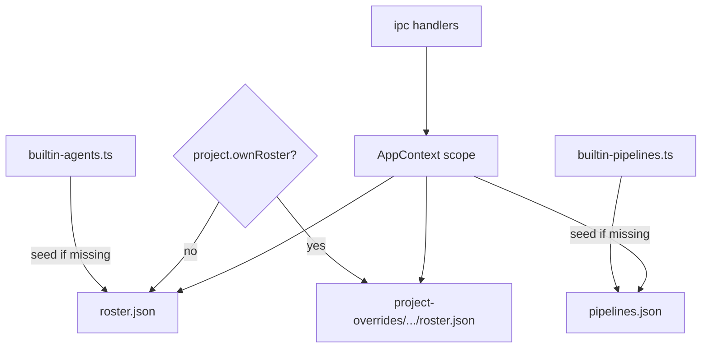

# Store

Active contributors: Foundry core (`src/main/store/`)

## Purpose

The store is Foundry's **JSON-backed configuration**: settings, projects, agent roster, and pipelines. Everything user-facing is a document a person could open, diff, or share. Nothing here is opaque binary state.

Built-in agents and pipelines are **seeds**. The first load (or a missing name after an upgrade) materialises them into the user's files. Editing a copy never writes back into the builtin source modules, and shipping a new builtin list must not clobber a user's already-edited agent or pipeline of the same name.

## Layout

Under the app support directory (see [Trace](trace.md) for the parent path):

```
settings.json
projects.json
roster.json
pipelines.json
project-overrides/<projectId>/
  roster.json          # only if project.ownRoster
  pipelines.json       # only if project.ownPipelines
```

Optional export of a project definition:

```
{repo}/.foundry/project.json
```

Projects themselves stay app-side so a repo needs no gitignore hygiene for Foundry to work. Export is for people who want the definition in the tree.

## Key abstractions

### `JsonStore<T>`

Small file store with in-memory cache, optional migrate-on-read, and atomic write (`path.tmp` then rename). Corrupt files fall back to the factory default and rewrite, so a bad edit cannot brick the app.

### Domain stores

| Class | File | Document |
|---|---|---|
| `SettingsStore` | `settings.json` | `AppSettings`: droid path, engineer name, defaults, poll cadence, retries, notifications, retention |
| `ProjectStore` | `projects.json` | List of `ProjectDef`: path, base ref, isolation, merge policy, commands, boundaries flags |
| `RosterStore` | `roster.json` (+ optional project override) | `AgentDef[]` |
| `PipelineStore` | `pipelines.json` (+ optional project override) | `PipelineDef[]` |

### Scope rule (project vs app)

A project may set `ownRoster` and/or `ownPipelines`. Lookup is **project-then-app**, never a merge of both lists. A half-inherited roster would make pipeline agent references ambiguous. Scope resolution is centralised on `AppContext` (`rosterScope` / `pipelineScope`).

### Builtins as seeds

| Module | Ships |
|---|---|
| `builtin-agents.ts` | Five agents: `planner`, `builder`, `scout`, `reviewer`, `documenter` |
| `builtin-pipelines.ts` | Seven pipelines: `prompt`, `scout`, `plan`, `plan-build`, `plan-build-test`, `plan-build-review`, `full-sdlc` |

On read, if a shipped builtin id/name is missing from the user's list, it is restored. Existing entries with that name keep the user's edits. `resetToBuiltins()` replaces the app-level list with fresh copies (project overrides are separate).

There is no tester agent: running a suite is a known command and therefore a **code** phase.

## How it works

### Settings

- Zod schema (`appSettingsSchema`) validates on **patch**, not on a blind save: bad values fail where the user typed them.
- Defaults include PATH lookup for `droid` (`findDroid`) and sensible retry/poll/timeout floors.
- `onboarded` gates the first-run screen in the [renderer](renderer.md).

### Projects

- Id is a hash of absolute path (`projectIdFor`), stable across renames of display name only.
- Fields include `commands` (named argv for code phases), `protectedPaths`, `allowedCommands`, merge policy, isolation.
- `export` writes `.foundry/project.json` into the repo.
- Adding a project from the UI uses a native folder dialog and requires a git repository (enforced in [IPC](ipc-and-preload.md)).

### Roster

- Agent schema enforces name shape, envelope kind, write globs (`writes: null` means unrestricted within engine policy), colour, prompts.
- Envelope example text is **not** baked into builtin prompts; it is generated from the zod schema at prompt render time so shape and parser cannot drift ([engine prompts](engine.md)).
- Save returns structured validation issues; duplicate creates a non-builtin copy with a unique name.

### Pipelines

- Pipelines are **data**, not scripts: phases of kind `agent`, `code`, or `engineer`, acceptance criteria, optional isolation.
- `validate()` is the Designer rail: unknown gates fail, agent must exist, prompt inputs that name `envelope:otherPhase` must refer to earlier phases, `feedbackTo` must point at an earlier agent phase, descriptions that only restate the phase name are rejected.
- Missing project commands are **warnings** (allowed save) so intermediate editing states stay workable; they become hard errors when a run starts if still unresolved.



## Integration

| Consumer | Use |
|---|---|
| [Engine](engine.md) | Receives concrete `PipelineDef`, `AgentDef[]`, and project commands at run start (snapshot also stored on the run row) |
| [IPC](ipc-and-preload.md) | Full CRUD, validate, dry-run, reset channels |
| [Renderer](renderer.md) | Roster and Pipelines screens; settings and project commands in Settings |
| [Doctor](system-services.md) | Project checks read `ProjectDef` (path, base ref, commands, leftover worktrees) |

Changing builtin source files only affects **new seeds**. User stores under Application Support remain authoritative for installed machines until the user resets.

## Entry points

| API | Role |
|---|---|
| `SettingsStore.get` / `patch` | Read and validated partial update |
| `ProjectStore.add` / `save` / `export` | Project lifecycle |
| `RosterStore.list` / `save` / `duplicate` / `resetToBuiltins` | Agents |
| `PipelineStore.list` / `save` / `validate` / `resetToBuiltins` | Pipelines |
| `AppContext.rosterFor` / `pipelinesFor` | Scoped lists for IPC and runs |

## Key source files

| Path | Role |
|---|---|
| `apps/desktop/src/main/store/json-store.ts` | Atomic JSON file store |
| `apps/desktop/src/main/store/settings.ts` | App settings + droid discovery |
| `apps/desktop/src/main/store/projects.ts` | Project documents |
| `apps/desktop/src/main/store/roster.ts` | Agent roster + project override |
| `apps/desktop/src/main/store/pipelines.ts` | Pipeline store + validation rail |
| `apps/desktop/src/main/store/builtin-agents.ts` | Seed agents |
| `apps/desktop/src/main/store/builtin-pipelines.ts` | Seed pipelines |
| `apps/desktop/src/main/context.ts` | Scope resolution for handlers |
| `apps/desktop/src/shared/types.ts` | `AppSettings`, `AgentDef`, `PipelineDef`, `ProjectDef` |

## Related

- [Engine](engine.md) (phases and gates referenced by pipeline validation)
- [IPC and preload](ipc-and-preload.md)
- [Features: pipelines](../features/pipelines.md), [roster](../features/roster.md) (when present)
- [Patterns and conventions](../how-to-contribute/patterns-and-conventions.md)
