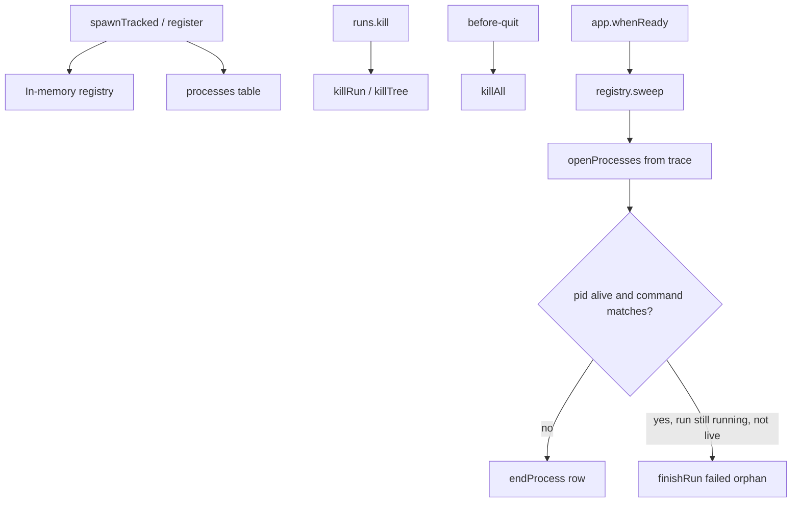

# System services

Active contributors: Foundry core (`src/main/system/`)

## Purpose

System services are the small, privileged utilities that keep Foundry honest on a real Mac: **environment diagnosis**, **user-visible outcomes**, and **child process hygiene**. They do not sequence pipelines. They make sure the operator can tell why the app cannot run, hears when a run finishes, and does not leave ghost processes or forever-`running` rows after a crash.

## Layout

```
src/main/system/
  doctor.ts    # environment and project checks
  notify.ts    # Notification + dock badge
  procs.ts     # spawn registry, kill tree, pid/command match
```

Callers: `main.ts` (relaunch sweep trigger, quit kill-all), `context.ts` (outcome + badge + needs-input), `ipc/maintenance.ts` (doctor and maintenance), `engine/registry.ts` (sweep and kill using procs helpers).

## Key abstractions

| Module | Abstraction |
|---|---|
| Doctor | `DoctorCheck`: id, label, ok, detail, optional fix action |
| Notify | Outcome notifications and dock badge driven only from run lifecycle hooks |
| Procs | In-memory registry of live children; pid + command verification for cross-launch kill |

## How it works

### Doctor (`doctor.ts`)

**App-level** `runDoctor(settings)`:

| Check | Meaning |
|---|---|
| `cli:<vendor>` | One per CLI. Binary runnable at its configured path; fix opens that vendor's install docs |
| `auth:<vendor>` | One per installed CLI. Its API key env var or its own config file is present |
| `junie:allowlist` | Only when Junie is installed. `~/.junie/allowlist.json` exists, without which an unattended Junie phase waits on an approval prompt |
| `git` | `git --version` on PATH |
| `macos` | Darwin major version at or above the supported floor (macOS 26 family check in code) |

Every vendor is reported, installed or not, because "Junie is not installed" is the answer to why Junie is missing from the roster picker. Only the **default** CLI and `git` set `blocking: true`, which is what onboarding refuses to continue past: an uninstalled fourth CLI is a fact about the machine, not a broken setup.

**Project-level** `checkProject(project)`:

| Check | Meaning |
|---|---|
| `path` | Folder still exists |
| `repo` | Path is a git repository |
| `base-ref` | Configured base ref resolves |
| `submodules` | Warns if `.gitmodules` present (worktrees do not populate them automatically) |
| `clean` | Base worktree porcelain empty (dirty base blocks automatic merge) |
| `commands` | At least one project command configured |
| `worktrees` | Leftover `.foundry-worktrees` entries; fix points at Maintenance |

Doctor runs at onboarding and from Settings. Results are plain data for `DoctorList` in the UI.

### Notifications (`notify.ts`)

- **`notifyOutcome`**: when a run reaches `accepted`, `rejected`, `failed`, or `killed`, if the matching settings flag is on and notifications are supported. Body is pipeline name plus a short request slice; subtitle is the branch when present.
- **`notifyNeedsInput`**: engineer or permission interrupts, gated by `notifications.needsInput`.
- **`setDockBadge`**: macOS dock badge shows live run count when `dockBadge` is enabled.

These are invoked from `AppContext` when the registry reports a finished run or a needs-input interrupt, so the banner, status, and notification share one finish path. See the engine's `finish` / `finishRun` settlement invariant in [Architecture](../overview/architecture.md).

### Process registry (`procs.ts`)

Every child the engine cares about should be:

1. **Spawned** (often via `spawnTracked`) and **registered** with run id, pid, and full command string.
2. **Recorded** in the trace `processes` table (via `Tracer.recordProcess`) for relaunch visibility.
3. **Unregistered** on exit; **ended** in the trace when closed.

Kill semantics:

- **`killTree`**: children first (`pgrep -P`), then parent, so killing a shell does not leave an orphaned tree.
- **`killRun`**: all pids currently registered for that run id.
- **`killAll`**: SIGKILL everything in the in-memory registry on app quit.
- **`commandMatches`**: before signalling a pid found only in the database (another launch), require that `ps` still shows a command containing the recorded head token. Recycled pids must not be killed.



### Orphan / relaunch sweep

On every launch, `main.ts` calls `ctx.registry.sweep(projects)`:

1. For each project's tracer, close process rows whose pid/command no longer match a live process.
2. For each `runs.status = 'running'` id that is **not** in the live in-memory map and has **no** remaining live processes, emit an error event and `finishRun(..., 'failed')`.

A run whose engine died with the app can never finish on its own; leaving it `running` would lie forever in the UI.

Separately, **orphan worktrees** (disk) are listed and removed through maintenance IPC (`worktree.findOrphans` / discard), not by `procs.ts`. Doctor's worktree check points operators at that Maintenance UI.

## Integration

| System | Touchpoint |
|---|---|
| [Trace](trace.md) | `processes` table; `finishRun` during sweep |
| [Engine](engine.md) / registry | register children, kill run, sweep, live count for badge |
| [IPC](ipc-and-preload.md) | `doctor.run`, maintenance orphans/retention/compact via `ipc/maintenance.ts` |
| [Store](store.md) | Notification flags, retention days, droid path |
| [Renderer](renderer.md) | DoctorList, settings notification toggles, interrupt sheet |

## Entry points

| Call | When |
|---|---|
| `runDoctor` / `checkProject` | Onboarding, Settings, `projects.check` |
| `notifyOutcome` / `notifyNeedsInput` / `setDockBadge` | `AppContext` lifecycle hooks |
| `register` / `spawnTracked` / `killRun` / `killAll` | Engine spawn and app quit |
| `commandMatches` / `isAlive` | Sweep and safe cross-launch kill |
| `RunRegistry.sweep` | Once at `app.whenReady` |

## Key source files

| Path | Role |
|---|---|
| `apps/desktop/src/main/system/doctor.ts` | App and project checks |
| `apps/desktop/src/main/system/notify.ts` | Notifications and dock badge |
| `apps/desktop/src/main/system/procs.ts` | Process registry and kill helpers |
| `apps/desktop/src/main/engine/registry.ts` | Relaunch sweep, kill run, live set |
| `apps/desktop/src/main/main.ts` | Sweep on ready; `killAll` on quit |
| `apps/desktop/src/main/context.ts` | Wires notify + badge to run events |
| `apps/desktop/src/main/ipc/maintenance.ts` | Doctor and maintenance handlers |

## Related

- [Trace](trace.md) (processes + finishRun)
- [Engine](engine.md)
- [IPC and preload](ipc-and-preload.md)
- [Features: worktrees](../features/worktrees.md), [onboarding](../features/onboarding.md) (when present)
