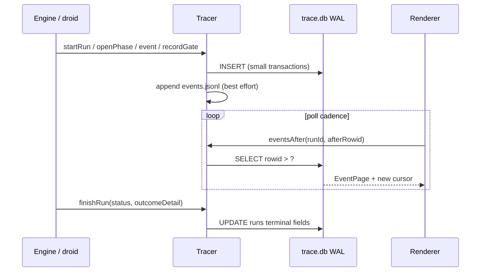

# Trace

Active contributors: Foundry core (`src/main/trace/`)

## Purpose

The trace is Foundry's **queryable record of every run**. Engine, droid adapter, and code phases all report through a single writer so a run's status, notification, and UI banner cannot disagree. The renderer never opens SQLite itself; it polls pages of events by `rowid` cursor. Live view and history are the same query at different cadences.

The database is a **mirror**. Raw prompts, pipeline snapshots, and a JSONL event log also land under a per-run directory on disk. Losing the database loses a queryable index, not the only copy of what happened.

## Layout

State is app-side, not in the project tree. `main.ts` sets the support root to `join(app.getPath('userData'), 'foundry')` (Electron `userData` is under `~/Library/Application Support/…` on macOS):

```
<supportDir>/
  projects/<hash>/
    trace.db              # better-sqlite3, WAL
    runs/<runId>/
      request.md
      pipeline.json
      events.jsonl
      <owner>/prompts/...
```

`<hash>` is the first 16 hex characters of SHA-256 of the absolute project path (`projectHash` in `db.ts`). That is the same hashing rule used for project ids in the [store](store.md).

## Key abstractions

| Piece | Role |
|---|---|
| `openDb` / `Db` | Opens (or creates) one SQLite file per project; applies schema and additive column migrations |
| `Tracer` | The only writer of run state for that project: runs, phases, events, envelopes, gates, sessions, processes, and run files |
| `eventsAfter(runId, afterRowid, limit)` | Cursor page for the UI (default limit 500) |
| Run files | Durable raw record under `runsDir`; JSONL append is best-effort so a file failure never aborts a run |

### Schema tables

| Table | Purpose |
|---|---|
| `runs` | One row per run: pipeline snapshot, worktree, branch, status, outcome, totals |
| `phases` | Ordered phases for a run; **default status is not success** (queued/running then earned terminal status) |
| `events` | Timeline: tool calls, agent starts/ends, gates, corrections, logs; carries optional `tokens` |
| `envelopes` | Parsed agent envelopes per attempt (valid flag, schema kind, payload) |
| `gate_results` | Per-gate pass/fail plus `checks_json` evidence |
| `agent_sessions` | Per (run, agent): model, effort, droid session id, context occupancy |
| `processes` | Spawned PIDs for kill path and relaunch [orphan sweep](system-services.md) |
| `migrations` | Schema version bookkeeping |

Phases deliberately **do not** store denormalised cost or model columns. Per-phase tokens, duration, and model are **derived** in the renderer from events (`src/renderer/derive.ts`). Run-level `total_tokens` is summed at `finishRun` from `agent_end` events; UI phase cost still comes from the event stream so retries stay visible.

## How it works

### Open and WAL

```ts
// openDb: journal_mode = WAL, synchronous = NORMAL, busy_timeout = 5000, foreign_keys ON
```

WAL means the renderer's polling reads never block the engine's writes. Schema is applied with `CREATE TABLE IF NOT EXISTS`; new columns arrive only via additive `COLUMN_MIGRATIONS` (never silent table rewrites).

### Single writer lifecycle

1. **`startRun`** inserts a `running` row, creates the run directory, writes `request.md` and `pipeline.json`.
2. **`openPhase` / `queuePhase` / `beginQueuedPhase`** insert phase rows. Opening a phase emits `phase_start`. Closing emits `phase_end` with the earned status.
3. **`event` / `endEvent` / `renameEvent`** append and patch timeline rows. Tool calls stream arguments, so rename-in-place avoids closing a span before the tool runs.
4. **`recordEnvelope`**, **`recordGate`** (also emits `gate_pass` / `gate_fail` events), **`upsertAgentSession`**, **`recordUsage`** (always records spend, even when the envelope failed to parse).
5. **`finishRun`** sets terminal status, `ended_at`, `total_tokens`, and optional `outcome_detail` in one update. Callers are expected not to write terminal `runs.status` elsewhere.

Every insert that matters also appends a line to `events.jsonl` when possible.

### Rowid cursor (the whole transport)

```sql
SELECT rowid, * FROM events
 WHERE run_id = ? AND rowid > ?
 ORDER BY rowid
 LIMIT 500;
```

There is no websocket, push stream, or separate replay path. The renderer keeps a `cursor` (last seen `rowid`) and asks for the next page. An index on `events(run_id)` is enough because rows for one run are already rowid-ordered.



### Processes table

Spawned engine, droid, and code children are recorded with pid and command string. On relaunch, [system services](system-services.md) and `RunRegistry.sweep` use `openProcesses` plus live pid/command checks to finalise runs that can never complete.

## Integration

| System | How it uses the trace |
|---|---|
| [Engine](engine.md) | Creates runs/phases, records envelopes and gates, finishes the run |
| [Droid](droid.md) | Emits tool spans, usage, session metadata through the tracer |
| [IPC](ipc-and-preload.md) | `runs.detail`, `runs.events`, list/archive/kill handlers call into `Tracer` |
| [Renderer](renderer.md) | Polls event pages; `derive.ts` sums usage from `agent_end` events |
| [System services](system-services.md) | Notifications and dock badge fire when the registry settles a finished run |

Do **not** add a denormalised `total_tokens` (or similar) column on `phases` to "simplify" the UI. Keep cost in events so multi-attempt phases stay honest. See [Patterns and conventions](../how-to-contribute/patterns-and-conventions.md).

## Entry points

| Call | When |
|---|---|
| `projectDbPath` / `projectRunsDir` | Resolve paths for a project under app support |
| `openDb(dbPath)` | Open or create the project database |
| `new Tracer(db, runsDir)` | Construct the single writer for that project |
| `tracer.eventsAfter` | Renderer poll via IPC |
| `tracer.finishRun` | Terminal settlement (also used by orphan sweep) |
| `tracer.compact` | WAL checkpoint + VACUUM from maintenance IPC |

## Key source files

| Path | Role |
|---|---|
| `apps/desktop/src/main/trace/db.ts` | Schema, WAL pragmas, project hash/path helpers, column migrations |
| `apps/desktop/src/main/trace/tracer.ts` | Single writer API, row mapping, run files, retention delete |
| `apps/desktop/src/renderer/derive.ts` | Phase usage, duration, model derived from events (not phase columns) |
| `apps/desktop/src/main/engine/registry.ts` | Owns per-project tracers; relaunch sweep over open processes |
| `apps/desktop/src/shared/types.ts` | `RunRow`, `PhaseRow`, `EventRow`, and related row types |

## Related

- [Engine](engine.md)
- [Droid harness](droid.md)
- [Renderer](renderer.md)
- [System services](system-services.md)
- [Architecture](../overview/architecture.md)
